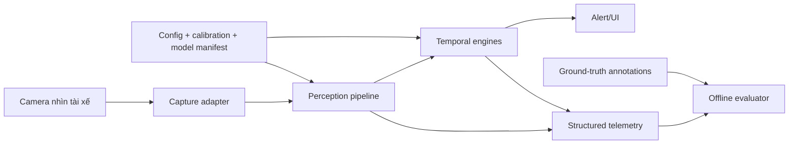
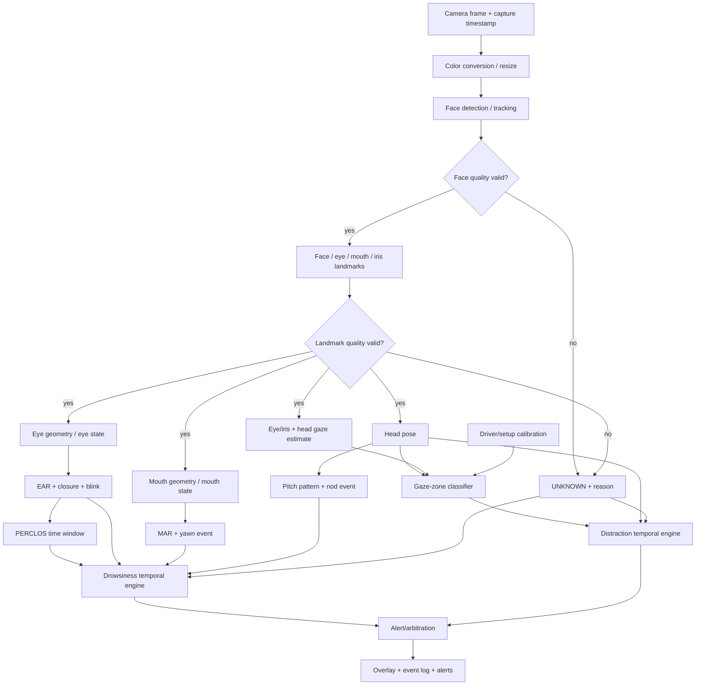
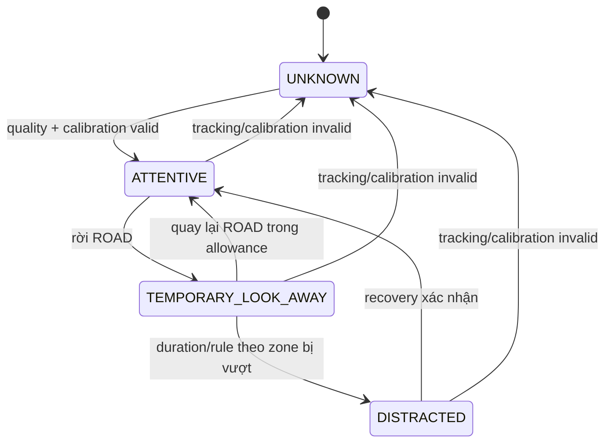

# Kiến trúc hệ thống

**Phiên bản thiết kế:** Phase 0 — 2026-09-22  
**Mục tiêu:** kiến trúc dễ học, đo được, thay thế từng module và có đường port thực tế từ PC/Pi 5 sang ESP32-P4.

## 1. Nguyên tắc kiến trúc

- **Perception không phải decision.** Landmark/eye state/head pose chỉ mô tả frame; state machine mới diễn giải chuỗi theo thời gian.
- **Không có dữ liệu không có nghĩa là bình thường.** Mọi module phát `valid`, `confidence` và `reason`; tầng quyết định có trạng thái `UNKNOWN`.
- **Duration dùng timestamp.** Frame có thể rơi hoặc FPS thay đổi, vì vậy không đổi “N frame” thành giây nếu chưa dùng timestamp.
- **Hai nguy cơ, hai output.** Drowsiness và distraction có thể cùng đúng; không dùng một enum duy nhất làm mất thông tin.
- **Baseline trước, model nặng sau.** Công thức/temporal rules là chuẩn đối chứng để biết deep model thực sự cải thiện gì.
- **Offline và live dùng cùng core.** Chỉ camera adapter khác; thuật toán và evaluator không được fork logic.
- **Mọi quyết định có provenance.** Config version, model hash, calibration ID và experiment ID đi cùng output.

## 2. System context



Camera tạo ảnh; perception trích tín hiệu; temporal engines hiểu diễn biến; alert chỉ trình bày kết quả; evaluator so output với ground truth. Tách như vậy giúp thay camera/model mà không viết lại metric.

## 3. Pipeline cuối cùng



## 4. Hợp đồng dữ liệu khái niệm

Đây chưa phải code; nó mô tả dữ liệu bắt buộc giữa module.

### 4.1 `FramePacket`

| Trường | Ý nghĩa |
|---|---|
| `frame_id` | số thứ tự tăng dần |
| `capture_timestamp_ns` | thời điểm capture theo monotonic clock |
| `receive_timestamp_ns` | thời điểm app nhận frame |
| `image` | pixel + color format + stride |
| `width`, `height` | kích thước ảnh |
| `source_id` | camera/video và session |
| `dropped_before` | số frame biết đã mất trước frame này, nếu đo được |

### 4.2 `Observation<T>`

Mọi quan sát như EAR/head pose/gaze zone có cùng envelope:

| Trường | Ý nghĩa |
|---|---|
| `value` | giá trị `T`, chỉ dùng khi valid |
| `valid` | module có đủ bằng chứng hay không |
| `confidence` | mức tin cậy nếu backend định nghĩa được; không tự bịa |
| `reason` | `NO_FACE`, `OCCLUDED`, `OUT_OF_RANGE`, `STALE`, ... |
| `source_frame_id` | frame tạo ra quan sát |
| `timestamp_ns` | thời điểm quan sát |
| `calibration_id` | calibration dùng, nếu có |

### 4.3 `Event`

Blink/yawn/nod/alarm là khoảng thời gian, không chỉ một frame:

- `event_type`, `start_ns`, `end_ns`;
- `peak_value` hoặc `severity` nếu định nghĩa;
- `evidence` trỏ tới quan sát nguồn;
- `valid_fraction` trong event;
- `rule_version` và `config_hash`.

## 5. Shared perception layer

### 5.1 Camera adapter

- PC: OpenCV-compatible webcam/video adapter để học và replay.
- Raspberry Pi 5: Picamera2/libcamera adapter; ưu tiên Camera Module 3 NoIR cho cabin tối khi có chiếu near-infrared phù hợp.
- ESP32-P4: camera stack/sensor được Espressif board và driver chính thức hỗ trợ. Không giả định Pi Camera Module 3 IMX708 tương thích P4.

Adapter chỉ tạo `FramePacket`. Phần còn lại không biết frame đến từ webcam, file hay CSI camera.

### 5.2 Preprocessing

Thực hiện ít nhất có thể: xác nhận color format, resize/crop có version và giữ transform tọa độ để map landmark về ảnh gốc. Không tăng contrast/sharpen mặc định vì có thể làm dataset và live khác nhau.

### 5.3 Face detection/tracking

Baseline PC/Pi: MediaPipe Face Landmarker candidate ở video/live mode, `num_faces=1`, nhưng vẫn cần chính sách chọn tài xế nếu có người khác xuất hiện. Tracking giúp tránh chạy detector từ đầu trên mọi frame; phải benchmark detector frequency và recovery khi mất mặt.

### 5.4 Landmark + quality gate

Quality gate kiểm tra:

- có đúng một face candidate hợp lệ;
- bbox đủ lớn và không cắt mắt/miệng;
- pose không vượt vùng mà landmark đã được kiểm chứng;
- landmark finite, đúng range và không stale;
- mắt/miệng không bị che quá mức;
- độ ổn định theo thời gian hợp lý;
- timestamp mới hơn observation trước.

Confidence của backend không được hiểu là xác suất “đúng” nếu tài liệu không nói vậy. Quality score của project chỉ được tạo sau khi từng thành phần được định nghĩa và hiệu chỉnh.

## 6. Nhánh drowsiness

### 6.1 EAR — Eye Aspect Ratio

Với sáu điểm quanh một mắt:

\[
EAR = \frac{\lVert p_2-p_6\rVert_2 + \lVert p_3-p_5\rVert_2}
{2\lVert p_1-p_4\rVert_2}
\]

- `p1`, `p4`: hai khóe mắt, tạo chiều ngang.
- `p2,p6` và `p3,p5`: hai cặp mí trên/mí dưới, tạo hai chiều dọc.
- `||a-b||₂`: khoảng cách Euclid `sqrt((x_b-x_a)^2 + (y_b-y_a)^2)`.
- Tử số giảm khi mí khép; mẫu số chuẩn hóa theo độ rộng mắt. Vì pixel/pixel nên EAR không có đơn vị.

Ví dụ: hai khoảng dọc đều 4 px, ngang 10 px thì `EAR=(4+4)/(2×10)=0.40`. Khi hai khoảng dọc còn 1 px, `EAR=0.10`. Đây chỉ minh họa toán học, **không** phải threshold dùng chung cho mọi người/model.

Nguồn công thức gốc: [Soukupová & Čech, 2016](https://vision.fe.uni-lj.si/cvww2016/proceedings/papers/05.pdf). Paper dùng chuỗi EAR và bộ phân loại theo cửa sổ; nó không chứng minh rằng một ngưỡng cố định áp dụng cho mọi camera/tài xế.

### 6.2 Eye state, blink và closure

1. Tính EAR hai mắt và quality riêng.
2. Chuẩn hóa theo calibration mở mắt của người/setup nếu được chứng minh hữu ích.
3. Dùng hysteresis: ngưỡng đóng và ngưỡng mở có thể khác để tránh rung trạng thái.
4. Blink là mẫu `OPEN → CLOSED → OPEN` trong khoảng thời gian hợp lệ.
5. Long closure là một `CLOSED` event vượt duration cấu hình.
6. Nếu quality mất giữa event, kết quả là unknown/ambiguous chứ không tự nối hai đoạn.

### 6.3 PERCLOS gốc và proxy của project

PERCLOS gốc nói về phần trăm thời gian mí mắt che phủ đồng tử đến một mức xác định. NHTSA từng đánh giá PERCLOS như chỉ dấu các lapse về chú ý thị giác; xem [DOT HS 808 762](https://rosap.ntl.bts.gov/view/dot/2518).

Vì baseline chỉ có eye state nhị phân, project phải gọi phép đo ban đầu là **`perclos_proxy`**:

\[
perclos\_proxy = \frac{\sum \Delta t_i\;I(eye_i=closed \land valid_i)}
{\sum \Delta t_i\;I(valid_i)}
\]

- `Δt_i`: thời lượng observation `i` có hiệu lực, đơn vị giây.
- `I(condition)`: bằng 1 khi điều kiện đúng, bằng 0 khi sai.
- Mẫu số loại thời gian `unknown`, đồng thời phải báo `valid_coverage` để tránh kết quả dựa trên quá ít dữ liệu.

Ví dụ trong cửa sổ 60 s: 12 s đóng hợp lệ, 45 s mở hợp lệ, 3 s unknown. Proxy là `12/(12+45)=0.2105`, tức 21.05%; coverage là `57/60=95%`. Không được tính 3 s unknown là mở.

### 6.4 MAR và yawn

MAR (Mouth Aspect Ratio) có nhiều cách chọn landmark. Project chưa khóa công thức ở Phase 0. Dạng khái niệm là:

\[
MAR = \frac{\text{độ mở dọc của môi}}{\text{độ rộng miệng}}
\]

Tỉ lệ giúp giảm ảnh hưởng scale nhưng vẫn phụ thuộc pose, nói, cười và landmark. Một yawn event cần pattern theo thời gian, ví dụ `CLOSED/NEUTRAL → OPENING → SUSTAINED_OPEN → CLOSING`; threshold/duration được hiệu chỉnh và không gọi “một frame MAR cao” là ngáp.

### 6.5 Head pose và head nod

Head pose cho ba góc quy ước yaw/pitch/roll. Candidate baseline dùng các cặp điểm mặt 3D chuẩn với điểm 2D quan sát và `solvePnP`; OpenCV mô tả bài toán là tìm pose từ tương ứng 3D–2D trong [tài liệu calib3d](https://docs.opencv.org/4.x/d5/d1f/calib3d_solvePnP.html).

Nod là mẫu pitch theo thời gian: baseline → đi xuống → điểm cực trị → quay về gần baseline, có amplitude/duration/return condition. `head down` kéo dài không tự động là nod hay drowsiness.

### 6.6 Drowsiness temporal engine

Input: `perclos_proxy`, long closure events, yawn events, nod events, quality coverage. Output đồng thời gồm state, severity, reasons và evidence.

```mermaid
stateDiagram-v2
    [*] --> UNKNOWN
    UNKNOWN --> NORMAL: quality đủ trong thời gian xác nhận
    NORMAL --> WARNING: bằng chứng mức vừa kéo dài
    WARNING --> NORMAL: recovery + hysteresis
    WARNING --> DROWSY: bằng chứng mạnh/đa tín hiệu
    DROWSY --> WARNING: recovery kéo dài
    NORMAL --> UNKNOWN: quality không đủ
    WARNING --> UNKNOWN: quality không đủ
    DROWSY --> UNKNOWN: quality không đủ; giữ log state trước
```



Không chốt trọng số ở Phase 0. Phase 7 phải làm sensitivity analysis và ghi nguồn/experiment cho từng weight.

## 7. Nhánh distraction

### 7.1 Tại sao head pose không đủ?

Mắt có thể nhìn lệch khi đầu gần như thẳng; đầu có thể quay về gương hợp lệ trong thời gian ngắn. Vì vậy nhánh này kết hợp head pose, hướng mắt/iris, vùng nhìn, duration và transition.

### 7.2 Gaze estimate nhẹ trước

Baseline ưu tiên:

1. chuẩn hóa tọa độ iris trong eye ROI;
2. kết hợp yaw/pitch của đầu;
3. calibration người + vị trí camera/ghế;
4. phân loại vùng nhìn, không cố dự đoán một điểm 3D chính xác giả tạo.

L2CS-Net chỉ là candidate optional. Paper gốc dự đoán góc gaze trong môi trường unconstrained nhưng model học sâu tạo chi phí và domain shift; xem [L2CS-Net paper](https://arxiv.org/abs/2203.03339).

### 7.3 Calibration gaze zone

Mỗi calibration record có:

- driver/setup ID ẩn danh;
- vị trí camera/ghế/gương;
- sample khi nhìn mỗi zone theo hướng dẫn an toàn, xe đứng yên;
- feature `head_yaw`, `head_pitch`, `iris_x`, `iris_y` và quality;
- centroid/range hoặc classifier nhẹ, version và thời điểm;
- validation samples khác calibration samples.

Calibration hết hiệu lực khi camera/ghế thay đổi đáng kể, mặt nằm ngoài vùng đã hiệu chỉnh hoặc drift vượt kiểm tra trung tâm.

### 7.4 Distraction state machine



Allowance khác nhau theo zone và chỉ được coi là giả thuyết cần đánh giá. Tài liệu NHTSA cho thấy rủi ro tăng khi eyes-off-road vượt 2 s trong ngữ cảnh nghiên cứu/guideline cụ thể; con số đó **không được sao chép mù quáng** thành threshold cho mọi mirror/dashboard event. Nguồn: [NHTSA distraction guideline notice](https://www.nhtsa.gov/sites/nhtsa.gov/files/distraction_npfg-02162012.pdf).

## 8. Đồng thời drowsy và distracted

Output chuẩn giữ hai trục:

```text
drowsiness_state  = NORMAL | WARNING | DROWSY | UNKNOWN
distraction_state = ATTENTIVE | TEMPORARY_LOOK_AWAY | DISTRACTED | UNKNOWN
```

Alert manager có thể ưu tiên âm thanh/UI theo severity nhưng log cả hai. Ví dụ `DROWSY + DISTRACTED` không bị đổi thành một nhãn chung; root cause/evidence vẫn còn.

## 9. Scheduling và độ trễ

Pipeline live nên dùng bounded queue rất ngắn (thường capacity 1 hoặc “latest frame”) để không xử lý hình đã cũ. Đây là policy cần benchmark, không phải kết quả.

- Camera chạy ở capture rate cấu hình.
- Face/landmark có thể chạy ở inference rate thấp hơn và track giữa các lần, nhưng observation stale phải bị từ chối.
- Temporal engine chạy mỗi observation mới theo timestamp.
- Rendering tách khỏi đường đo inference.
- Log writer không được block capture; khi quá tải phải đếm record bị mất.

FPS và latency không nhất thiết là nghịch đảo trong pipeline song song. Một pipeline có throughput 30 FPS vẫn có thể có latency 150 ms nếu nhiều frame đồng thời nằm trong các stage.

## 10. Benchmark instrumentation points

```text
t0 sensor/capture timestamp (nếu driver cung cấp)
t1 frame đến application
t2 preprocessing xong
t3 face/landmark xong
t4 feature extraction xong
t5 temporal decision xong
t6 overlay/output xong
```

- Software queue age: `t1 - t0` nếu `t0` đáng tin cậy.
- Inference latency: thời gian đúng quanh model call.
- End-to-end software latency: `t6 - t1`.
- Sensor-to-display latency thật cần phương pháp vật lý (ví dụ LED + high-speed reference); không được gọi queue age là camera latency tuyệt đối.

## 11. Kiến trúc triển khai theo nền tảng

| Module | PC/Pi 5 baseline | ESP32-P4 khả thi? | Thay đổi dự kiến |
|---|---|---|---|
| Camera | OpenCV / Picamera2 + IMX708 NoIR | Có, nhưng không cùng camera mặc định | Sensor/driver/ISP P4 đã xác minh; board hiện hành |
| Face detect | MediaPipe task candidate | Có | ESP-WHO/ESP-DL face detector |
| Dense landmarks + iris | MediaPipe Face Landmarker | Rủi ro rất cao | Model landmark nhỏ hoặc eye/mouth classifiers riêng |
| EAR/MAR | NumPy/OpenCV geometry | Có nếu có điểm | C/C++ fixed buffers; ít điểm |
| PERCLOS/state machines | Python timestamp logic | Có | C/C++; ring buffer/time accumulators |
| Head pose | OpenCV `solvePnP` | Có điều kiện | Solver nhỏ/ước lượng đơn giản; camera intrinsics cố định |
| Gaze zone | Head + iris + calibration | Khó | Zone classifier nhẹ; có thể bỏ deep gaze |
| L2CS-Net | Optional PyTorch/ONNX | Không phải baseline | Chỉ nếu conversion/operator/memory chứng minh được |
| Overlay | OpenCV UI | Có giới hạn | LVGL/display hoặc telemetry serial; optional |
| Evaluation | Python offline | Không cần trên device | Log rồi đánh giá trên PC |

### Snapshot P4 quan trọng

Tính đến 2026-09-22, datasheet ESP32-P4 v0.7 vẫn ghi **PRELIMINARY**, dòng P4X có dual-core RISC-V đến 400 MHz và biến thể 16/32 MB in-package PSRAM. Board P4-EYE/P4-Function-EV revision cũ đã có lộ trình EOL; acquisition nên kiểm tra board P4X hiện hành thay vì mua theo tên chung. Nguồn: [ESP32-P4 datasheet](https://documentation.espressif.com/esp32-p4_datasheet_en.html) và tài liệu board chính thức.

Repo `esp-video-components` được kiểm tra ngày 2026-09-22 không liệt kê driver IMX708 trong `esp_cam_sensor`; MIPI-CSI connector không đủ để kết luận tương thích. Driver sensor, pinout/điện áp, RAW ISP tuning và autofocus đều phải khớp. Candidate feasibility ban đầu là board P4X hiện hành với camera bundle chính thức; NIR/no-IR-cut là bài toán phần cứng riêng sau đó.

## 12. Vì sao Pi 5 dễ hơn P4?

Raspberry Pi 5 chạy Linux, có bộ nhớ lớn hơn nhiều, virtual memory, filesystem, process/thread, Python và wheel thư viện dựng sẵn. ESP32-P4 là MCU: RAM/PSRAM, cache và bandwidth bị giới hạn; camera buffers cùng tensor trung gian cạnh tranh bộ nhớ; operator và data layout phải đúng runtime; cấp phát động gây phân mảnh/rủi ro thời gian thực.

Trên P4, file model nhỏ chưa đủ. Cần đo đồng thời:

```text
frame buffers
+ input tensor
+ intermediate tensors / tensor arena
+ output tensor
+ stack per task
+ heap/runtime metadata
+ display/network buffers
= peak working memory
```

Quantization INT8 giảm byte mỗi phần tử so với FP32 nhưng có thể giảm độ chính xác và không giải quyết operator thiếu. DMA chuyển dữ liệu mà không bắt CPU copy từng byte, nhưng vẫn cần buffer đúng vùng/alignment. SIMD/PIE tăng tốc nhiều phép toán song song nhưng chỉ giúp kernel đã tối ưu cho instruction đó.

## 13. Camera NoIR và cabin tối

Camera Module 3 NoIR không có IR-cut filter, vì vậy có thể nhận near-infrared mà bản thường cố chặn để màu ban ngày tự nhiên hơn. `NoIR` không có nghĩa camera tự chiếu sáng. Cabin tối vẫn cần illuminator phù hợp phổ nhạy sensor. 850 nm là bước sóng 850 nanomet; thường cho hiệu suất camera tốt nhưng có thể thấy ánh đỏ rất nhẹ ở nguồn. Hạn chế gồm màu sai ban ngày, phản xạ kính, vùng sáng tối không đều và yêu cầu eye-safety.

Quy tắc dự án:

- không tự chế/tăng công suất IR chiếu vào mắt;
- dùng sản phẩm có tài liệu an toàn quang sinh học và giới hạn làm việc;
- đo cả visible và NIR domain;
- đánh dấu illumination mode trong metadata;
- không giả định model RGB giữ accuracy dưới NIR.

## 14. Configuration architecture

Ba lớp cấu hình:

1. `base.yaml`: schema và default không phụ thuộc thiết bị.
2. deployment config: camera/backend/performance cho PC, Pi, P4.
3. calibration artifact: giá trị theo camera/driver, không commit thông tin nhận dạng.

Mỗi threshold cần: tên, đơn vị, giá trị, nguồn (`heuristic`, `paper`, `calibration`, `trained`), experiment ID, ngày và range hợp lệ. Config được hash vào log.

## 15. Privacy, safety và threat model tối thiểu

- Mặc định xử lý on-device và lưu feature/event thay vì video khi không cần debug.
- Video mặt là dữ liệu nhạy cảm: consent, retention, encryption/access control phải được định nghĩa trước thu thập.
- Không quay thử hành vi trên đường công cộng; xe đứng yên hoặc simulator.
- Không yêu cầu người tham gia thiếu ngủ, dùng chất gây buồn ngủ hay nhắm mắt khi điều khiển xe.
- Alert prototype không được tạo cảm giác đã thay thế trách nhiệm nghỉ/ngừng lái xe.
- Model/file download phải có hash/provenance; source license và model/data license được kiểm riêng.

## 16. Architecture Decision Records tóm tắt

| ADR | Quyết định | Lý do | Khi nào xem lại |
|---|---|---|---|
| ADR-001 | Modular signals + temporal rules | Dễ hiểu, test và port | Sau Phase 12 baseline |
| ADR-002 | Separate drowsiness/distraction states | Có thể đồng thời; metric khác | Nếu UI cần severity hợp nhất |
| ADR-003 | First-class UNKNOWN | Tránh false normal khi camera hỏng | Không bỏ; chỉ tinh chỉnh reason |
| ADR-004 | Timestamp-based duration | Chịu frame drop/FPS đổi | Không bỏ |
| ADR-005 | MediaPipe candidate, không cam kết | Nhanh tạo baseline nhưng cần compatibility/accuracy test | Phase 2, 14, 16 |
| ADR-006 | Pi 5 CPU first | Có baseline để biết accelerator có đáng không | Phase 15 |
| ADR-007 | P4 thay perception, giữ feature/temporal contracts | MediaPipe/Python không phải target P4 | Phase 16 |
| ADR-008 | `perclos_proxy` trước | Eye-state nhị phân không hoàn toàn là PERCLOS gốc | Khi có eyelid-coverage model/GT |
