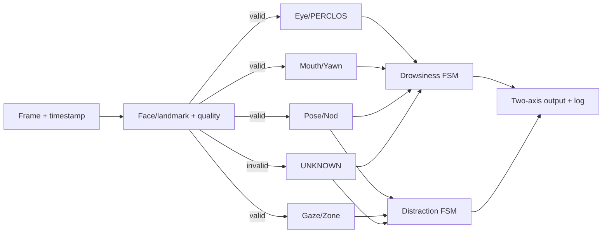

# PHASE 00 REPORT — Research + System Design

**Ngày hoàn thành:** 2026-09-22  
**Kết quả:** hoàn tất thiết kế và kiểm chứng nguồn; chưa viết thuật toán, chưa cài dependency, chưa tải dữ liệu/model, chưa chạy benchmark runtime.  
**Cảnh báo:** đây là đồ án nghiên cứu/học tập, không phải thiết bị y tế, không được dùng làm lớp bảo vệ an toàn duy nhất khi lái xe.

# 1. Mục tiêu phase

Phase 0 trả lời trước khi code:

1. Project thật sự cần giải bài toán nào và không giải bài toán nào?
2. Tầng camera, perception, temporal decision, evaluation và deployment nối nhau ra sao?
3. Repository/framework/dataset/hardware nào tồn tại thật, phiên bản và license hiện tại là gì?
4. MVP kết thúc ở đâu; phần nào optional?
5. Benchmark thế nào để không so sai hoặc bịa số?
6. Dữ liệu tự quay thế nào để an toàn, có consent và không gọi hành vi diễn là ground truth y khoa?
7. Pi 5 và ESP32-P4 khác nhau ở đâu; module nào có nguy cơ không port nguyên trạng?

# 2. Phase này nằm ở đâu trong pipeline tổng thể?

```text
┌──────────────────────────────────────────────────────────────┐
│ PHASE 0: nguồn → yêu cầu → kiến trúc → protocol → stop gate │
└──────────────────────────────────────────────────────────────┘
                              ↓ (chưa đi tiếp)
 Camera → Face/Landmark → Features → Temporal → Decisions → Evaluation
                              ↓
                     Pi 5 → Optimize → P4
```

Phase 0 không tạo perception output. Nó tạo “bản đồ” và các quy tắc chứng minh để những phase sau không chạy theo demo ngắn rồi nhầm là hệ thống hoàn chỉnh.

# 3. Input

- Master specification 2,388 dòng do người dùng cung cấp.
- Workspace `D:\DA`, ban đầu trống và chưa là Git repository.
- Official websites/repositories/documentation, original papers và dataset portals.
- Môi trường dev read-only inventory: Windows/Python/Git/packages hiện có.
- Ngày tham chiếu 2026-09-22; mọi dữ kiện “current/latest” phải gắn ngày này.

# 4. Output

| File | Vai trò |
|---|---|
| `PLAN.md` | MVP, 21 phase, dependencies, folder structure, gates, risks |
| `ARCHITECTURE.md` | Modules, contracts, state machines, math signals, platform mapping |
| `DATASET_CATALOG.md` | Access/license/content/size/strategy/self-record protocol |
| `REPOSITORY_REVIEW.md` | 8 repo chính, versions, licenses, use/no-use decisions |
| `GLOSSARY.md` | Bảng thuật ngữ + phiếu giải thích sâu |
| `PROJECT_PROGRESS.md` | Trạng thái, decisions, open issues, stop gate |
| `PHASE_00_REPORT.md` | Tài liệu học và bằng chứng Phase 0 |

# 5. Thuật ngữ mới

Các thuật ngữ có phiếu đầy đủ trong `GLOSSARY.md`. Tóm tắt cần nhớ cho Phase 0:

- **DMS:** hệ thống theo dõi tài xế; ở đây chỉ là nguyên mẫu camera-based.
- **Computer Vision:** biến pixel thành thông tin như mặt/điểm/hướng.
- **Edge AI:** chạy nhận biết gần camera trên PC/Pi/MCU, không phụ thuộc cloud.
- **Perception:** trả lời frame đang cho thấy gì.
- **Temporal processing:** đọc chuỗi observation qua thời gian để tạo event/state.
- **Baseline:** phương án đầu làm mốc so sánh, không đồng nghĩa phương án cuối.
- **Quality gate:** chặn quyết định khi bằng chứng không đủ; tạo `UNKNOWN` thay vì `NORMAL` giả.
- **Calibration:** thu mẫu tham chiếu theo người/camera/ghế.
- **Benchmark:** phép đo theo protocol có thể lặp lại, không chỉ một số FPS trên màn hình.
- **Dataset license:** quyền pháp lý sử dụng; link tải công khai không phải license.
- **Subject-independent split:** cùng một người không xuất hiện ở train và test.
- **Data leakage:** test ảnh hưởng quá trình xây model/threshold, làm metric cao giả.
- **Domain shift:** dữ liệu triển khai khác dữ liệu phát triển, ví dụ RGB ban ngày so với NoIR/NIR.
- **MCU:** vi điều khiển tài nguyên chặt; ESP32-P4 không phải PC Linux thu nhỏ.
- **Quantization:** đổi biểu diễn số, thường FP32→INT8, để giảm tài nguyên nhưng có trade-off accuracy.

# 6. Lý thuyết

## 6.1 Bốn lớp bằng chứng

```text
Pixel evidence       Landmark/pose/eye geometry
        ↓
Frame observation    EAR, eye state, MAR, head pose, gaze feature
        ↓
Temporal event       blink, long closure, yawn, nod, look-away
        ↓
System state         drowsiness state / distraction state
```

Mỗi tầng có lỗi riêng. Một state cuối chỉ đáng tin khi có đường truy vết về observations, timestamps, quality và rule version.

## 6.2 Drowsiness không phải một dấu hiệu

PERCLOS/closure, yawn và nod là tín hiệu quan sát được, không phải chẩn đoán nguyên nhân sinh lý. Fusion dùng nhiều tín hiệu để giảm phụ thuộc một failure mode, nhưng không biến prototype thành thiết bị y tế.

## 6.3 Distraction không phải “đầu quay = sai”

Mirror/dashboard/display checks ngắn có thể hợp lệ. Cần zone + duration + transition + recovery. Head pose chỉ là một cue; mắt có thể liếc khi đầu thẳng.

## 6.4 Missing data không phải negative data

Nếu kính phản sáng làm mất mắt, “không thấy mắt đóng” không chứng minh mắt mở. Do đó `UNKNOWN`, valid coverage và failure rate là output/metric bắt buộc.

# 7. Toán học

## 7.1 Khoảng cách Euclid và EAR

Với `a=(x1,y1)`, `b=(x2,y2)`:

\[
d(a,b)=\sqrt{(x_2-x_1)^2+(y_2-y_1)^2}
\]

`x/y` là vị trí pixel hoặc tọa độ cùng hệ; `d` có cùng đơn vị. Nếu cả tử/mẫu là pixel thì tỉ lệ không có đơn vị.

\[
EAR = \frac{d(p_2,p_6)+d(p_3,p_5)}{2d(p_1,p_4)}
\]

Hai khoảng dọc đo mí mở; khoảng ngang chuẩn hóa scale. Ví dụ dọc `4,4`, ngang `10`: EAR=`8/20=0.40`; khi dọc `1,1`: EAR=`2/20=0.10`. Con số chỉ minh họa, không phải universal threshold. Nguồn: [Soukupová & Čech](https://vision.fe.uni-lj.si/cvww2016/proceedings/papers/05.pdf).

## 7.2 PERCLOS proxy theo thời gian

\[
P=\frac{\sum_i \Delta t_i I(closed_i \land valid_i)}
{\sum_i \Delta t_i I(valid_i)}
\]

`Δt_i` tính bằng giây; `I` là hàm chỉ báo 0/1. Trong 60 s có 12 s closed, 45 s open, 3 s unknown: `P=12/57=21.05%`, coverage=`57/60=95%`. Unknown không được tính là open. PERCLOS gốc nói mức mí che đồng tử; binary value này được gọi `perclos_proxy`. Nguồn lịch sử/validation: [NHTSA DOT HS 808 762](https://rosap.ntl.bts.gov/view/dot/2518).

## 7.3 Confusion matrix

Với positive=`DROWSY`:

- TP: cảnh báo và ground truth drowsy.
- TN: không cảnh báo và ground truth non-drowsy.
- FP: cảnh báo nhầm.
- FN: bỏ sót drowsy.

\[
Accuracy=\frac{TP+TN}{TP+TN+FP+FN}
\]

\[
Precision=\frac{TP}{TP+FP},\quad Recall=\frac{TP}{TP+FN}
\]

\[
Specificity=\frac{TN}{TN+FP},\quad
F1=2\frac{Precision\cdot Recall}{Precision+Recall}
\]

Ví dụ TP=18, FP=2, FN=3, TN=77:

- Accuracy=95/100=95%;
- Precision=18/20=90%;
- Recall=18/21≈85.7%;
- Specificity=77/79≈97.5%;
- F1=36/41≈87.8%.

Accuracy 95% vẫn che ba trường hợp nguy hiểm bị bỏ sót. Khi normal áp đảo, classifier luôn đoán normal có Accuracy cao nhưng Recall nguy hiểm bằng 0.

## 7.4 Macro và micro

Với nhiều gaze zones, tính Precision/Recall/F1 từng zone. Macro average lấy trung bình đều các zone nên zone hiếm vẫn có trọng lượng. Micro cộng TP/FP/FN của tất cả zone trước rồi tính nên bị lớp đông chi phối. Báo macro F1 + per-zone recall + confusion matrix.

## 7.5 MAE pose

\[
MAE=\frac{1}{N}\sum_{i=1}^{N}|\hat{\theta_i}-\theta_i|
\]

`N` là số sample; `θ̂` dự đoán, `θ` ground truth, cùng đơn vị degree. Dự đoán `[5,-2,10]°`, thật `[3,-1,7]°`: sai tuyệt đối `[2,1,3]°`, MAE=`2°`. Phải xử lý wrap-around của góc nếu range đi qua ±180°.

## 7.6 Gaze angular error

\[
\theta=\cos^{-1}\left(
\frac{g_p\cdot g_t}{\|g_p\|\|g_t\|}
\right)
\]

`g_p/g_t` là vector gaze dự đoán/thật; dot product đo mức cùng hướng; norm là độ dài. Clamp tỉ số vào `[-1,1]` để tránh lỗi số. `θ_rad×180/π` ra degree. Hai vector đơn vị `(1,0,0)` và `(√3/2,1/2,0)` cho 30°.

## 7.7 Event overlap

Temporal IoU:

\[
IoU=\frac{duration(predicted\cap ground\ truth)}
{duration(predicted\cup ground\ truth)}
\]

GT `[10.0,12.5]s`, dự đoán `[10.4,13.0]s`: giao 2.1 s, hợp 3.0 s, IoU=0.70. Match threshold và one-to-one matching phải đăng ký trước, không đổi sau khi xem test result.

## 7.8 False alarms/hour và time-to-detect

\[
FA/h=\frac{false\ alarm\ events}{evaluated\ valid\ hours}
\]

Ba false alarms trong 2 giờ hợp lệ → 1.5 FA/h. Denominator phải loại/ghi thời gian không đánh giá được theo protocol.

\[
TTD=t_{alarm}-t_{event\ onset}
\]

TTD âm có thể là false/early alarm tùy matching rule; không tự lấy trị tuyệt đối.

## 7.9 FPS, latency và energy/frame

\[
FPS=\frac{processed\ frames}{elapsed\ seconds}
\]

`Latency=t_output-t_input`; báo ms và percentile. `Watt=Joule/second`, nên:

\[
Energy/frame\approx\frac{Power\ (J/s)}{FPS\ (frame/s)}
\]

Ví dụ 5 W ở 10 processed FPS → 0.5 J/frame. Chỉ tính khi power/FPS đo cùng interval. Nếu trừ idle, gọi rõ `dynamic energy/frame`.

# 8. Thuật toán

## 8.1 Algorithm tổng thể dự kiến

1. Capture frame + monotonic timestamp.
2. Preprocess có lưu transform.
3. Detect/track driver face.
4. Quality gate; nếu fail phát `UNKNOWN + reason`.
5. Extract landmarks/pose/eye-mouth features.
6. Tạo observations có validity/timestamp.
7. Update event detectors theo thời gian.
8. Update drowsiness và distraction state machines độc lập.
9. Alert/arbitrate nhưng giữ hai state và evidence.
10. Log, overlay và evaluate offline.

## 8.2 Algorithm calibration gaze

1. Cố định camera/seat setup; xe đứng yên.
2. Thu neutral/ROAD samples có quality tốt.
3. Thu từng zone với thứ tự random/repeat.
4. Tách calibration samples khỏi validation samples.
5. Fit range/centroid/classifier nhẹ trên `head_yaw`, `head_pitch`, `iris_x/y`.
6. Tính confusion matrix/macro F1 trên validation samples.
7. Lưu artifact + metadata/hash.
8. Runtime kiểm drift; invalid thì `UNKNOWN/recalibrate`.

## 8.3 Algorithm event evaluation

1. Chốt ontology, tolerance/IoU và positive class.
2. Sắp event theo thời gian.
3. Tạo candidate overlaps cùng type.
4. Match one-to-one theo rule đã đăng ký.
5. Matched → TP; prediction không match → FP; GT không match → FN.
6. Tính precision/recall/F1, onset/offset error và TTD.

# 9. Sơ đồ pipeline



# 10. Implementation

Phase 0 chỉ tạo tài liệu Markdown:

- `PLAN.md`
- `ARCHITECTURE.md`
- `DATASET_CATALOG.md`
- `REPOSITORY_REVIEW.md`
- `GLOSSARY.md`
- `PROJECT_PROGRESS.md`
- `PHASE_00_REPORT.md`

Không tạo `src/`, không cài package, không tải model/dataset, không scaffold firmware.

# 11. Code architecture

Chưa có code. Dependency direction đã thiết kế:

```text
apps → orchestration → domain modules → contracts
camera adapters ────────────────┘
backends/models ────────────────┘
telemetry/evaluation đọc contracts, không bị domain gọi ngược
```

Temporal domain không được import UI/camera backend. Điều này giúp replay cùng observation trên PC và P4.

# 12. Giải thích code quan trọng

Không áp dụng vì chưa code. Các logic sẽ cần giải thích đầu tiên ở Phase 1:

- monotonic timestamp khác wall-clock;
- buffer/queue và frame dropping;
- color format conversion;
- cách instrument timing mà không tính nhầm rendering.

# 13. Dataset sử dụng

Không dataset nào được tải/dùng trong Phase 0. Chiến lược đã chọn:

- DMD 2026: distraction/gaze, restricted form, public release chỉ 14 subject RGB.
- UTA-RLDD: video-level drowsiness, license chưa rõ.
- YawDD: yawn + talking/singing negatives, IEEE login và điều khoản cần thận trọng.
- Drive&Act: optional activity, research-only, direct downloads.
- NTHU-DDD: optional night/IR robustness, signed agreement.
- Self-recorded: bắt buộc cho calibration/domain, chỉ simulated behavior.

Chi tiết nguồn, size, annotation, access/license và limitation ở `DATASET_CATALOG.md`.

# 14. Preprocessing

Chưa chạy. Nguyên tắc tương lai:

1. raw archives/video bất biến;
2. checksum và source/license manifest;
3. subject split trước clip/frame extraction;
4. timestamps không mất khi convert;
5. giữ transform resize/crop;
6. không normalize bằng statistics của test;
7. idempotent: chạy lại không tạo khác biệt im lặng;
8. output có preprocessing version/config hash;
9. derived label không ghi đè annotation gốc;
10. samples commit vào Git chỉ khi có quyền phân phối.

# 15. Config / threshold

Chưa có threshold số. Schema yêu cầu tương lai:

```yaml
name: eye_closed_threshold
value: TBD
unit: ear_ratio
source: calibration | validation | heuristic | paper
experiment_id: TBD
valid_for:
  landmark_model_sha256: TBD
  camera_setup_id: TBD
notes: TBD
```

Hysteresis cần `enter`/`exit` riêng nếu rung trạng thái. Mọi duration dùng second, không dùng frame count thuần.

# 16. Cách chạy

Phase 0 không có application để chạy. Thứ tự review tài liệu:

```text
PLAN.md
→ ARCHITECTURE.md
→ DATASET_CATALOG.md
→ REPOSITORY_REVIEW.md
→ GLOSSARY.md
→ PHASE_00_REPORT.md
→ PROJECT_PROGRESS.md
```

Phase 1 chỉ bắt đầu khi người dùng yêu cầu rõ.

# 17. Cách kiểm tra output

Checklist:

- đúng 7 file Phase 0 tồn tại;
- `PHASE_00_REPORT.md` có 30 section;
- repo table có đủ 8 repo;
- dataset catalog có 4 bộ yêu cầu + self-recorded và supplemental có lý do;
- mỗi fact hiện hành có ngày/source;
- unresolved license ghi unclear, không suy diễn;
- metric/benchmark chưa đo ghi N/A, không có số kết quả giả;
- Phase 1 vẫn NOT STARTED trong progress;
- link nội bộ tới file tồn tại;
- UTF-8/Vietnamese hiển thị đúng.

# 18. Test

Các kiểm tra read-only đã làm trong Phase 0:

| Test | Kết quả |
|---|---|
| Inventory workspace | Trống lúc bắt đầu; không Git repo |
| OS/Python/Git/package inventory | Ghi exact trong `PLAN.md` |
| Official repo link/status/version/license review | Hoàn tất với caveat registry/tag |
| Dataset official URL/access/license review | Hoàn tất; nhiều restriction/unclear được giữ nguyên |
| Hardware docs review | Pi 5, Camera 3 NoIR, P4/P4X, camera compatibility |
| Cross-check “latest release” vs tag/registry | Phát hiện lệch MediaPipe, ESP-DL, ESP-WHO, OMZ |
| Runtime algorithm/unit tests | N/A — không code |
| Hardware benchmark | N/A — không có/không chạy thiết bị |

# 19. Metric

Metric plan theo level:

| Level | Metric chính | Câu hỏi trả lời |
|---|---|---|
| Frame | confusion matrix, per-class P/R/F1 | Frame eye/gaze được phân lớp đúng không? |
| Regression | MAE/angular error | Pose/gaze lệch bao nhiêu degree? |
| Event | event P/R/F1, onset/offset error | Blink/yawn/nod/alarm có được bắt trọn không? |
| Alarm/session | false alarms/hour, TTD | Hệ có gây phiền/báo muộn không? |
| Coverage | valid coverage, unknown/failure rate | Hệ kết luận trên bao nhiêu dữ liệu nhìn được? |
| Deployment | FPS, p50/p95/p99 latency, drop, CPU/RAM/temp/power | Có chạy được và ổn định trên edge không? |

Mỗi report phải ghi positive class, unit đánh giá (frame/event), matching rule, split và confidence interval nếu phù hợp.

Ba nhóm không được đánh đồng:

| Nhóm | Ví dụ | Nó trả lời gì? |
|---|---|---|
| Training | loss, validation loss, learning curve, overfitting/underfitting | Quá trình học có hội tụ/tổng quát sơ bộ không? |
| Model/system quality | Precision, Recall, F1, MAE, false alarms/hour, TTD | Dự đoán/event/alarm đúng đến đâu? |
| Deployment | FPS, latency, RAM, power, temperature, model size | Chạy trên thiết bị tốn gì và nhanh đến đâu? |

Training loss thấp không chứng minh DMS tốt. Nếu chỉ fine-tune weights mà không đổi architecture, input shape hay numeric precision, inference latency/model size thường không tự cải thiện; trước–sau vẫn phải đo accuracy/F1, generalization, latency và model size.

# 20. Benchmark

## 20.1 Kết quả Phase 0

| Device | Workload | FPS | Latency | RAM | CPU | Temp | Power | Quality metric |
|---|---|---:|---:|---:|---:|---:|---:|---:|
| PC | Không chạy | N/A | N/A | N/A | N/A | N/A | N/A | N/A |
| Raspberry Pi 5 | Không có benchmark | N/A | N/A | N/A | N/A | N/A | N/A | N/A |
| ESP32-P4 | Không có benchmark | N/A | N/A | N/A | N/A | N/A | N/A | N/A |

Đây là kết quả thật: **chưa đo**.

## 20.2 Protocol đã thiết kế

Hai track:

1. **Compute-only:** cùng decoded frames/tensors, tắt camera/render/log nặng, cùng model/input/precision nếu có thể.
2. **End-to-end deployment:** camera native→ISP→preprocess→inference→temporal→alert; đây là so hệ thống khi sensor khác.

Manifest khóa board/SKU/revision, OS/IDF/compiler, clocks/governor/cooling/power, model hash/format/precision, camera/exposure/focus/illumination, render/log/network. P4 cũ/mới không được gộp vì binary/clock khác.

Cold start tách power-on→first valid decision và app/task start→first valid decision. Steady-state proposal: warm-up ≥5 phút, đo ≥10 phút hoặc ≥10,000 processed frames, 5 repeats; con số là **protocol proposal**, chưa là result.

Timing points: capture dequeue, format/copy, resize/normalize, face, landmark/eye/mouth, pose, gaze, temporal/fusion, render/output. Báo capture FPS, submitted FPS, processed/inference FPS, output FPS, drop count và frame age.

# 21. Visualization

Ba visualization được chọn vì giúp hiểu quan hệ:

1. Pipeline phân lớp trong `ARCHITECTURE.md`.
2. State diagrams drowsiness/distraction, thể hiện `UNKNOWN` và hysteresis.
3. Timeline ở phase sau: EAR/MAR/pitch/gaze-zone + event + state trên cùng trục thời gian.

Không tạo chart số ở Phase 0 vì chưa có measurements.

# 22. Các lỗi gặp phải

## 22.1 Nội dung nguồn thay đổi hoặc không nhất quán

- DMD website lịch sử mô tả 25 TB/multimodal nhưng public 2026 chỉ 14 subject RGB.
- UTA-RLDD public Drive không kèm license rõ.
- YawDD có 342/351 inconsistency và DataCite/consent terms cần áp dụng thận trọng.
- Drive&Act landing/paper lệch số view/action.
- OMZ có tag nhưng không GitHub release và đang maintenance mode.
- ESP-DL GitHub Latest chậm hơn Component Registry.
- ESP-WHO v0.5.0 “Latest” là bản cũ; master refactored chưa semver.
- MediaPipe GitHub release 1.0.0 trong khi PyPI 1.0.1.

## 22.2 Compatibility dễ bị suy diễn sai

- Pi có CSI camera không làm Camera Module 3 tương thích P4.
- MediaPipe `.task` không phải file ESP-DL `.espdl`.
- P4 SIMD/AI instruction extension không phải NPU độc lập.
- 25 W nguồn Pi không phải power consumption đã đo.
- Camera dequeue time không phải photon-to-app latency thật.

# 23. Cách sửa

- Gắn ngày/snapshot/commit vào mọi claim thay đổi theo thời gian.
- Phân biệt current public dataset với historical corpus.
- License unclear → giữ unclear, hỏi owner; không dùng mirror để “sửa”.
- Phân biệt GitHub release, tag, Registry và HEAD.
- Dùng compatibility smoke test trước lock dependency.
- Tách P4 reproduction profile khỏi latest-study profile.
- Tách sensor support, connector, driver, ISP tuning và autofocus thành các gate riêng.
- Đổi tên binary eye ratio thành `perclos_proxy` để tránh claim quá mức.

# 24. Failure cases

Hệ thống dự kiến thất bại khi:

- mặt ngoài khung/quá nhỏ/quay quá lớn;
- kính phản sáng, kính râm, tay che mắt/miệng;
- NIR làm appearance khác training domain;
- motion blur/exposure transition/one-side light;
- nhiều người làm chọn sai driver;
- talking/laughing bị nhầm yawn;
- head-down hold bị nhầm nod;
- mirror check ngắn bị nhầm distraction;
- dropped frame làm duration sai nếu đếm frame;
- calibration cũ sau khi camera/seat đổi;
- face/landmark backend thay index/output semantics;
- temporal queue xử lý frame quá cũ.

# 25. Edge cases

- mắt nhỏ, facial hair, makeup;
- một mắt bị che, hai mắt disagree;
- camera near/far/offset/rung;
- autofocus hunting;
- passenger vào frame;
- tài xế nói/hát/cười/ngáp có che miệng;
- road/mirror zones gần nhau trong feature space;
- cảnh báo drowsy và distracted cùng lúc;
- loss of tracking trong event;
- system clock điều chỉnh; lý do dùng monotonic clock;
- Pi thermal throttling;
- P4 internal RAM đủ nhưng largest contiguous block không đủ;
- model operator tồn tại nhưng attribute/layout không hỗ trợ.

# 26. Limitations

- Phase 0 là desk research; chưa kiểm model/camera/hardware bằng execution.
- Website/repo có thể đổi sau 2026-09-22.
- License summary không phải tư vấn pháp lý.
- Self-recorded cỡ nhỏ không đại diện dân số tài xế.
- Một camera không quan sát cognitive/manual distraction đầy đủ.
- Eye/head cues không chứng minh trạng thái y khoa.
- P4 feature set/latency/accuracy chưa biết cho tới Phase 16–19.
- Không có safety certification, redundancy hay fail-operational design.
- Không có ground-truth gaze vector/pose cho mọi dataset.

# 27. Các quyết định kỹ thuật

| Quyết định | Tại sao A thay B? |
|---|---|
| Modular thay end-to-end giant model | Dễ học/test/port; thấy rõ nguồn lỗi |
| Rule baseline trước ML | Cần mốc minh bạch; ML chỉ đáng dùng nếu đo được cải thiện |
| `UNKNOWN` thay default normal | Missing evidence không chứng minh an toàn |
| Timestamp thay frame count | Chịu FPS đổi/drop |
| Hai state axes thay one-label | Drowsiness/distraction có thể đồng thời |
| `perclos_proxy` thay gọi PERCLOS chung chung | Baseline chưa đo phần trăm eyelid coverage thật |
| MediaPipe candidate trên PC/Pi | Có face/iris landmarks và official Pi path, nhưng vẫn benchmark |
| Picamera2 APT thay pip pin | Giữ tương thích libcamera/OS |
| Pi CPU first | Cần baseline trước accelerator |
| Coarse gaze zone trước deep gaze | Sát decision cần, nhẹ và calibratable |
| Subject split thay random frame split | Đo generalization sang người mới |
| P4 supported camera first | CSI connector không đảm bảo IMX708 stack |
| ESP-WHO lock reproduction trước upgrade | Tách lỗi upstream reproduction khỏi dependency upgrade |
| P4 best-achievable report thay parity giả | Tôn trọng constraint thực và trade-off |

# 28. Tôi cần nhớ gì sau phase này?

1. Camera tạo pixel, không tạo “buồn ngủ”.
2. Frame observation, temporal event và system state là ba mức khác nhau.
3. Không nhìn thấy không đồng nghĩa bình thường; phải có `UNKNOWN`.
4. EAR/MAR là feature hình học, không phải ground truth.
5. `perclos_proxy` nhị phân không hoàn toàn là PERCLOS gốc.
6. Gaze zone cần calibration vì camera/ghế/người khác nhau.
7. Accuracy cao có thể che nhiều FN; luôn xem Recall/F1/false alarms/hour/TTD.
8. Split theo subject trước khi cắt frame để tránh leakage.
9. Link tải không tự động cấp license hay quyền redistribution.
10. Pi và P4 cần hai implementation perception khác; giữ contract/temporal logic là phần tái sử dụng.

# 29. Câu hỏi tự kiểm tra

1. Vì sao một frame mắt nhắm không đủ kết luận drowsy?
2. `UNKNOWN` khác `NORMAL` như thế nào và tại sao cần cả hai?
3. Vì sao duration phải dựa timestamp thay vì số frame?
4. EAR giảm ảnh hưởng khoảng cách camera bằng cách nào, và nó vẫn nhạy với yếu tố gì?
5. `perclos_proxy` khác PERCLOS gốc ở điểm nào?
6. Tại sao random frame split có thể gây data leakage?
7. Precision và Recall trả lời hai câu hỏi thực tế nào cho alarm?
8. Vì sao mirror look ngắn không được gắn `DISTRACTED` ngay?
9. Vì sao MediaPipe `.task` không thể giả định chạy trên ESP-DL?
10. Cần những bằng chứng nào trước khi nói một tối ưu P4 “tốt hơn”? 

# 30. Phase sau sẽ dùng lại kiến thức gì?

Phase 1 dùng:

- contract `FramePacket` và monotonic timestamp;
- phân biệt camera FPS, processed FPS, latency và queue age;
- color format/resolution/buffer glossary;
- adapter boundary giữa PC/Picamera2;
- measurement manifest và nguyên tắc không gọi proxy là latency thật;
- dependency policy để tránh hai provider `cv2`;
- stop/report/progress/benchmark logging discipline.

Phase 1 **chưa bắt đầu**.

---

## Phụ lục A — Hardware facts đã kiểm chứng

### Raspberry Pi 5

BCM2712, 4× Arm Cortex-A76 64-bit 2.4 GHz; LPDDR4X-4267 1/2/4/8/16 GB; băng thông công bố tối đa 17 GB/s; VideoCore VII GPU, ISP và hai MIPI camera/display 4-lane. Không có NPU chuyên dụng được product docs liệt kê. Raspberry Pi khuyến nghị active cooling khi tải nặng. Camera Module 3 cáp 15-pin trong khi Pi 5 dùng mini 22-pin nên cần Standard–Mini cable. Nguồn: [Pi 5 product](https://www.raspberrypi.com/products/raspberry-pi-5/), [product brief](https://pip-assets.raspberrypi.com/categories/892-raspberry-pi-5/documents/RP-008348-DS-4-raspberry-pi-5-product-brief.pdf), [camera docs](https://www.raspberrypi.com/documentation/accessories/camera.html).

### Camera Module 3 NoIR

Sony IMX708 back-illuminated stacked CMOS, 11.9 MP, 4608×2592, 1.4 µm pixels; RAW10 CSI-2; PDAF/autofocus; NoIR không có IR-cut filter. NoIR nhận visible+IR nhưng không tự phát sáng; cabin tối cần illuminator phù hợp. 850 nm là bước sóng cận hồng ngoại, không phải power. Nguồn: [product page](https://www.raspberrypi.com/products/camera-module-3/) và [product brief](https://datasheets.raspberrypi.com/camera/camera-module-3-product-brief.pdf).

### ESP32-P4/P4X

Datasheet v0.7 ngày 2026-07-14 còn PRELIMINARY cho revision v3.x/P4X: dual-core 32-bit RISC-V tới 400 MHz, LP core 40 MHz, single-precision FPU, Xai/SIMD, 768 KB HP L2MEM, 16/32 MB in-package PSRAM variants, camera/display/ISP/JPEG/H.264/PPA/DMA. Xai là instruction extension, không phải NPU. PSRAM interface theoretical bandwidth không được gọi là application benchmark. Nguồn: [datasheet](https://documentation.espressif.com/esp32-p4_datasheet_en.html), [technical reference manual](https://documentation.espressif.com/esp32-p4_technical_reference_manual_en.pdf), [revision PCN](https://documentation.espressif.com/en/PCN202600801_ESP32-P4_Chip_Revision_v3.2_Upgrade_Chip_Revision_v1.3_Demand_Collection_and_EOL_Plan_Description.html).

Board P4 revision cũ 360 MHz có EOL path; acquisition mới ưu tiên P4X. [P4X-EYE](https://docs.espressif.com/projects/esp-dev-kits/en/latest/esp32p4/esp32-p4x-eye/user_guide.html) là candidate feasibility với camera bundle chính thức; tài liệu không cho phép suy ra camera đó là NoIR/NIR-ready.

## Phụ lục B — Source quality hierarchy đã dùng

1. Official hardware/framework documentation và registry.
2. Official repository ở exact tag/commit.
3. Original peer-reviewed/preprint paper của tác giả.
4. Official dataset website/portal/metadata DOI.
5. Secondary source chỉ để phát hiện vấn đề, không dùng thay license/source gốc.

## Phụ lục C — Stop statement

Theo yêu cầu, công việc dừng ở Phase 0. Không có hành động Phase 1 nào được thực hiện ngầm.
