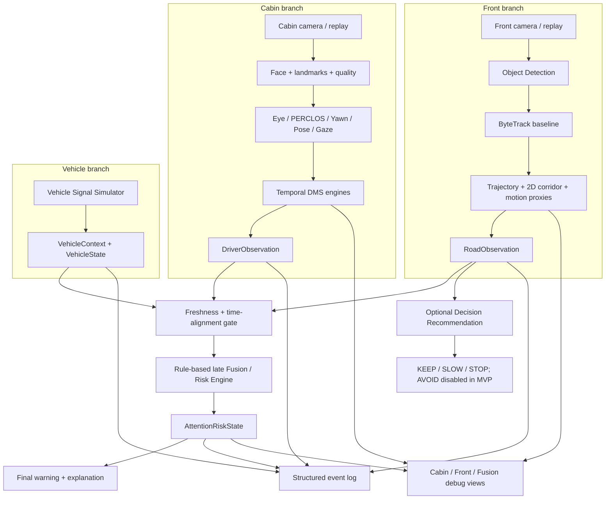
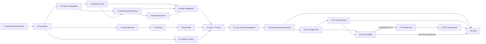

# Kế hoạch tổng thể đã hợp nhất — Context-Aware Driver Attention Risk

**Trạng thái:** Bản plan hợp nhất chờ người dùng duyệt; **chưa bắt đầu Phase 0 mới, chưa code**  
**Ngày audit repository:** 2026-09-23 (Asia/Bangkok)  
**Ngày kiểm tra nguồn mới:** 2026-09-22 đến 2026-09-23  
**Nền tảng:** PC phát triển → Raspberry Pi 5 baseline đầy đủ → ESP32-P4 feasibility/nhánh tối ưu riêng  
**Phạm vi:** hai camera, Vehicle Context giả lập và late fusion; nguyên mẫu nghiên cứu/học tập, không phải hệ thống an toàn ô tô đã chứng nhận.

> Tài liệu Phase 0 cũ đã hoàn thành tốt phần DMS một camera. Nó được giữ làm nền, không bị xóa. Tuy nhiên, nó **không** được xem là Phase 0 hoàn tất cho scope hai camera mới. Theo yêu cầu hiện tại, lượt này chỉ sửa `PLAN.md`; `ARCHITECTURE.md`, `DATASET_CATALOG.md`, `REPOSITORY_REVIEW.md`, `GLOSSARY.md`, `PROJECT_PROGRESS.md` và report cũ chưa được đồng bộ cho tới khi người dùng duyệt plan này.

## 1. Kết quả audit và điểm xuất phát

Repository hiện có đúng bảy file Markdown:

- `PLAN.md`, `ARCHITECTURE.md`, `DATASET_CATALOG.md`, `REPOSITORY_REVIEW.md`;
- `GLOSSARY.md`, `PROJECT_PROGRESS.md`, `PHASE_00_REPORT.md`.

Không có Git repository, `src/`, `tests/`, `configs/`, model, dataset, downloader, implementation hay benchmark runtime. Các tài liệu cũ cũng tự ghi rõ Phase 1 chưa bắt đầu và mọi metric runtime là `N/A`. Vì vậy plan này thiết kế toàn hệ thống từ đầu theo thứ tự phụ thuộc, nhưng **mở rộng plan DMS hiện có**, không tạo một dự án thứ hai.

### Nội dung DMS cũ phải giữ

- modular perception + temporal logic;
- face/landmarks và quality gate;
- eye state, EAR, blink, long closure, `perclos_proxy`;
- MAR, yawn; head pose, nod; eye/head gaze và gaze zones;
- drowsiness, fatigue indicators và visual distraction là các khái niệm khác nhau;
- `UNKNOWN` là trạng thái hạng nhất, không phải `NORMAL`;
- duration dựa timestamp, không dựa số frame;
- rule-based baseline trước ML;
- metric frame/event/session và subject-independent split;
- PC/Pi 5 trước, ESP32-P4 sau; không hứa feature parity;
- report sau từng phase rồi dừng chờ review.

## 2. Mục tiêu cuối và cách gọi đúng hệ thống

Tên mô tả đúng của prototype là:

> **Context-aware driver attention risk** — đánh giá mức rủi ro chú ý của tài xế dựa trên hành vi tài xế, nguy cơ phía trước và trạng thái vận hành của xe.

Hệ thống phải trả lời câu hỏi:

> “Tài xế đang nhìn lệch khỏi vùng cần quan sát có thực sự đáng cảnh báo mạnh ở thời điểm này không?”

Ba trục đầu vào:

1. **Driver state:** drowsiness, fatigue indicators, eye/head/gaze behaviour và visual distraction.
2. **Road risk:** object nào có khả năng xung đột với corridor/quỹ đạo gần của xe.
3. **Vehicle context:** xe đang parked, drive-ready, moving, temporary-stop hay unknown.

### Phân biệt ba khái niệm cabin

| Khái niệm | Dự án hiểu là gì | Không được suy diễn thành |
|---|---|---|
| Drowsiness | Trạng thái nguy cơ buồn ngủ ngắn/trung hạn suy từ closure, PERCLOS proxy, nod, yawn và diễn biến thời gian | Chẩn đoán y khoa hoặc “mệt” nói chung |
| Fatigue indicators | Chỉ dấu tích lũy như yawn lặp, blink/closure trend, tư thế; luôn ghi là proxy quan sát được | Khẳng định nguyên nhân sinh lý thật |
| Visual distraction | Ánh nhìn/đầu rời vùng phù hợp quá lâu hoặc lặp bất thường trong bối cảnh xe đang vận hành | Luật ngây thơ `gaze != ROAD` |

Mirror check ngắn, quan sát hai bên hay nhìn display trong khoảng phù hợp không tự động là distraction. Các threshold theo zone/duration/repetition phải nằm trong config và được đánh giá bằng experiment.

### Thứ tự ưu tiên

```text
Correctness
   ↓
Understandability
   ↓
Modularity
   ↓
Measurement
   ↓
Optimization
```

## 3. Nguyên tắc thiết kế khóa từ đầu

1. Không fuse raw image của hai camera trong MVP.
2. Mỗi nhánh hoạt động và benchmark độc lập trước khi fusion.
3. Perception chỉ mô tả điều quan sát được; temporal/risk/decision logic mới diễn giải.
4. Tracker chỉ tạo ID, history và trajectory; tracker không hiểu hazard và không quyết định `STOP/AVOID`.
5. Late fusion đầu tiên là rule table có explanation, không phải model học sâu.
6. Mọi observation có capture timestamp, produced timestamp, validity, reason, provenance và freshness.
7. `UNKNOWN`, `STALE`, `NO_FACE`, `CAMERA_BLOCKED` không được đổi thành `SAFE/LOW`.
8. Mọi threshold có tên, đơn vị, nguồn và experiment ID; không rải magic number trong code.
9. Queue phải bounded; frame cũ được drop có đếm thay vì tạo backlog.
10. Structured logs và visualization phục vụ debug/benchmark, không làm UI đẹp trước logic.
11. Raspberry Pi 5 CPU là baseline đầy đủ đầu tiên; tối ưu chỉ sau profiling.
12. ESP32-P4 là target khác về runtime/model/memory, không phải Pi thu nhỏ.
13. Cabin dataset và road dataset rời chỉ đánh giá module; không được dùng để claim multimodal fusion.
14. Cảnh báo/khuyến nghị không phải lệnh điều khiển xe thật.

## Kết quả A–I để review

| Mục | Kết quả trong plan |
|---|---|
| A. Architecture | Ba nhánh `DriverObservation + RoadObservation + VehicleContext` qua time-alignment và rule-based late fusion; xem mục A. |
| B. Danh sách phase | 20 phase từ merged research tới final comparison; xem bảng B/C và đặc tả 15 mục/phase. |
| C. Phase ownership | Mỗi phase gắn nhóm DMS, Front Detection, Tracking, Road Risk, Vehicle Context, Fusion, Pi hoặc ESP32. |
| D. Dependency | DMS/front/vehicle phát triển độc lập sau foundation rồi hội tụ ở Fusion; xem Mermaid mục D. |
| E. Scope tiers | Functional MVP tới Phase 13; Edge MVP tới Phase 14; P4 conditional; advanced không tự động mở. |
| F. Dataset | Tách đúng cabin/detection/tracking/risk/fusion; paired synchronized data bắt buộc để claim fusion. |
| G. Model/tracker | Pi: YOLO26n-NCNN; control YOLO11n. Tracker: ByteTrack; BoT-SORT CMC conditional. P4: ESPDet-Pico candidate. |
| H. Risks | 22 risk/gate về timing, domain, tracking, monocular proxy, license, Pi load và P4 feasibility. |
| I. Exclusions | Không raw fusion, full autonomy, AVOID, real CAN, segmentation hay P4 parity trong MVP. |

## A. Kiến trúc sau khi merge



### Ranh giới trách nhiệm

| Module | Trả lời câu hỏi | Không được làm |
|---|---|---|
| Cabin DMS | Tài xế đang thể hiện dấu hiệu gì qua thời gian? | Tự suy road hazard |
| Detector | Frame hiện tại có object nào, box/class/score gì? | Giữ identity qua thời gian |
| Tracker | Box nào có khả năng là cùng object, history ra sao? | Gắn nhãn nguy hiểm/STOP |
| Road Risk | Track nào đang vào corridor/approaching/crossing? | Suy trạng thái tài xế |
| Vehicle Context | Xe đang vận hành trong state nào? | Thay thế road perception |
| Fusion | Ba observation cùng thời điểm dẫn tới warning nào? | Che mất `UNKNOWN` hoặc evidence gốc |
| Decision recommendation | Gợi ý `KEEP/SLOW/STOP` trong simulator | Điều khiển actuator thật; tạo `AVOID` khi chưa biết free space |

## 4. Data contracts bắt buộc

Đây là contract thiết kế, chưa phải code. Phase 1 sẽ cài bằng typed dataclass và validation rõ ràng.

### `FramePacket`

```text
frame_id
source_id                 # cabin/front/file/replay
camera_role               # CABIN | FRONT
capture_timestamp_ns      # monotonic domain
receive_timestamp_ns
produced_format           # RGB/BGR/YUV + width/height/stride
image
dropped_before
validity + reason
```

### Envelope chung `Observation<T>`

```text
value: T
capture_timestamp_ns
produced_timestamp_ns
validity                  # VALID | UNKNOWN | LOW_QUALITY | STALE
confidence                # chỉ khi backend định nghĩa; không mặc nhiên là xác suất đúng
reason[]
source_frame_id
source_id
model_or_rule_version
config_hash
calibration_id
```

### `DriverObservation`

```text
timestamp
face_detected
eye_state
perclos_proxy + valid_coverage
yawn_state / yawn_event
head_pose / nod_event
gaze_zone / gaze_duration / repetition evidence
drowsiness_state
fatigue_indicator_state
visual_distraction_state
confidence / validity / reasons
```

### `TrackedObject` và `RoadObservation`

```text
TrackedObject:
    track_id              # ID tạm trong một stream, không phải identity người
    class_name
    bbox + bottom_center
    detection_score
    track_age_s / last_seen_age_s
    position_history[]
    motion_class          # approaching/crossing/stable/moving_away/unknown
    track_quality

RoadObservation:
    timestamp
    tracked_objects[]
    dangerous_object_ids[]
    danger_zone_occupancy
    road_risk             # LOW/MEDIUM/HIGH/CRITICAL/UNKNOWN
    min_ttc               # nullable; chỉ có khi ttc_valid=true
    ttc_valid + ttc_method
    confidence / validity / reasons
```

### `VehicleContext`

```text
timestamp
speed_kmh
gear                      # P/R/N/D/UNKNOWN
brake
parking_brake
engine_state
steering_angle_deg
turn_signal
vehicle_state             # PARKED/DRIVE_READY/MOVING/TEMPORARY_STOP/UNKNOWN
validity / reasons
```

### `AttentionRiskState`

```text
timestamp
driver_state_axes         # drowsiness + fatigue indicator + distraction
road_risk
vehicle_state
final_risk
warning_type
explanation[]
evidence_refs[]
input_ages_ms
sync_skew_ms
validity / degraded_reasons
```

### Quy tắc semantics

- Track ID chỉ ổn định trong session; không phải nhận dạng người/vật thể ngoài đời.
- `confidence` của detector, landmark và rule engine không được cộng trực tiếp như cùng một xác suất.
- `RoadObservation=LOW` chỉ hợp lệ khi front branch thực sự quan sát được; camera hỏng phải là `UNKNOWN`.
- Fusion giữ nguyên ba state đầu vào trong output để truy vết nguyên nhân.
- Một warning có thể vẫn phát từ nhánh còn hợp lệ khi nhánh khác `UNKNOWN`, nhưng output phải là degraded và nói rõ nguồn thiếu.

## 5. Time synchronization và freshness

Hai camera không cần hardware sync trong MVP, nhưng phải dùng cùng monotonic clock của process và ghép observation theo policy cấu hình:

1. Mỗi frame nhận capture/receive timestamp ngay tại adapter.
2. Mỗi inference output giữ timestamp của frame nguồn, không thay bằng thời điểm inference kết thúc.
3. Fusion chọn observation gần thời điểm fusion nhất trong `sync_window_ms` và dưới `max_*_age_ms`.
4. Quá cũ hoặc lệch cửa sổ → `STALE/UNKNOWN`; không dùng “latest value” vô thời hạn.
5. Dropped frame, delayed inference, queue age và inference latency được log riêng.

Ví dụ: model xử lý một frame mất 50 ms là **inference latency 50 ms**. Nó không có nghĩa tài xế distracted 50 ms; distraction duration là khoảng giữa lúc gaze rời zone hợp lệ và lúc trở về/được kết luận theo timestamp hành vi.

## 6. Structured event log và visualization

Mỗi record hợp nhất tối thiểu có:

```text
event_id, experiment_id, timestamp, driver_source_frame_id, front_source_frame_id
driver_validity, driver_state, fatigue_indicator, gaze_zone, gaze_duration
road_validity, road_risk, dangerous_object_id, object_class, motion_class, ttc, ttc_valid
vehicle_validity, speed_kmh, gear, vehicle_state
sync_skew_ms, input_ages_ms, final_warning, explanation
model_versions, config_hashes, calibration_ids, processing_latencies_ms
```

Visualization tối thiểu:

- Cabin: face box, landmarks, eye/yawn/head/gaze, timer, three driver-state axes.
- Front: boxes, class/score, ID, trajectory, corridor, dangerous object, Road Risk, TTC chỉ khi valid.
- Fusion: Vehicle State, input ages/validity, driver risk, road risk, final warning và explanation.

Rendering không nằm trên đường đo inference mặc định. UI đẹp là ngoài MVP; overlay phục vụ debug trước.

## 7. Detection khác tracking như thế nào?

- **Detection:** xử lý từng frame độc lập. Frame này có `person`, `car`, `motorcycle` và box tương ứng.
- **Tracking:** nối detection qua nhiều frame. Person ở frame trước là ID 3 và frame hiện tại vẫn có khả năng là ID 3.
- **Trajectory:** chuỗi vị trí của một track theo timestamp.
- **Association:** bài toán ghép track cũ với detection mới.
- **ID switch:** tracker đang gọi object là ID 3 rồi nhầm sang ID 8.
- **Kalman Filter:** dự đoán object có thể xuất hiện ở đâu ở frame kế tiếp và sửa dự đoán bằng detection mới.
- **Hungarian Algorithm:** tìm cách ghép một-một có tổng chi phí nhỏ nhất, thay vì mỗi track tham lam chọn box gần nhất.
- **Re-ID:** dùng đặc trưng ngoại hình để hỗ trợ ghép khi che khuất; tăng compute/privacy risk và không phải nhận dạng danh tính đời thực.

Tracker **không** tự hiểu nguy hiểm. Road Risk là module riêng nhận track history, corridor và quality.

## 8. Sổ công thức bắt buộc cho plan/report

Mọi report phase dùng công thức phải lặp lại đủ: công thức, từng ký hiệu, trực giác, ví dụ số, nơi dùng. Các ví dụ dưới đây là minh họa, không phải threshold.

### M01 — Duration từ monotonic timestamp

1. **Công thức:** `Δt = (t_end_ns - t_start_ns) / 1,000,000,000`.
2. **Ký hiệu:** `t_start_ns`, `t_end_ns` là timestamp nano-giây; `Δt` là số giây.
3. **Trực giác:** lấy mốc kết thúc trừ mốc bắt đầu rồi đổi nano-giây sang giây.
4. **Ví dụ:** `12,500,000,000 - 10,000,000,000 = 2,500,000,000 ns = 2.5 s`.
5. **Dùng tại:** blink/yawn/nod/gaze duration, queue age, latency và timeout.

### M02 — Age và synchronization skew

1. **Công thức:** `age_i = t_fusion - t_i`; `skew = max(t_driver,t_road,t_vehicle) - min(...)`.
2. **Ký hiệu:** `t_i` là capture time observation nguồn `i`; `t_fusion` là mốc fusion; `age_i` và `skew` cùng đơn vị thời gian.
3. **Trực giác:** age nói dữ liệu cũ bao lâu; skew nói ba nguồn cách nhau bao xa.
4. **Ví dụ:** driver 10.120 s, road 10.135 s, vehicle 10.125 s → skew `10.135-10.120=0.015 s=15 ms`.
5. **Dùng tại:** freshness/time-alignment gate trước fusion.

### M03 — Tọa độ chuẩn hóa về pixel

1. **Công thức:** `x_px=x_norm×W`, `y_px=y_norm×H`.
2. **Ký hiệu:** `x_norm,y_norm` nằm trong 0–1; `W,H` là chiều rộng/cao ảnh; `x_px,y_px` là pixel.
3. **Trực giác:** vị trí 50% chiều ngang của ảnh 640 px nằm ở pixel 320.
4. **Ví dụ:** `(0.5,0.25)` trên ảnh `640×480` → `(320,120)`.
5. **Dùng tại:** map bbox/landmark/trajectory/corridor giữa ảnh resize và ảnh gốc.

### M04 — Khoảng cách Euclid và EAR

1. **Công thức:** `d(a,b)=sqrt((x_b-x_a)^2+(y_b-y_a)^2)`; `EAR=(d(p2,p6)+d(p3,p5))/(2d(p1,p4))`.
2. **Ký hiệu:** `p1,p4` là hai khóe mắt; hai cặp còn lại đo độ mở mí; `d` là khoảng cách hai điểm.
3. **Trực giác:** mí khép làm hai khoảng dọc giảm trong khi chiều ngang thay đổi ít hơn.
4. **Ví dụ:** dọc `4,4`, ngang `10` → EAR `8/20=0.40`; dọc `1,1` → `2/20=0.10`.
5. **Dùng tại:** eye state, blink và closure; không phải universal threshold.

### M05 — PERCLOS proxy

1. **Công thức:** `perclos_proxy = closed_valid_time / valid_time`.
2. **Ký hiệu:** tử là tổng giây mắt closed hợp lệ; mẫu là tổng giây eye observation hợp lệ; unknown bị loại và coverage báo riêng.
3. **Trực giác:** đo phần thời gian quan sát hợp lệ mà mắt ở trạng thái closed.
4. **Ví dụ:** 12 s closed, 45 s open, 3 s unknown trong cửa sổ 60 s → `12/57=21.05%`, coverage `57/60=95%`.
5. **Dùng tại:** drowsiness temporal engine; gọi đúng là proxy nhị phân.

### M06 — MAR khái niệm

1. **Công thức:** `MAR = vertical_lip_opening / mouth_width`.
2. **Ký hiệu:** tử là khoảng mở dọc theo landmark đã version; mẫu là bề ngang miệng cùng hệ tọa độ.
3. **Trực giác:** miệng mở làm tỉ lệ tăng nhưng nói/cười cũng có thể làm tăng.
4. **Ví dụ:** mở dọc 12 px, rộng 48 px → MAR `0.25`.
5. **Dùng tại:** mouth state/yawn event; mapping landmark và threshold chỉ khóa ở Phase 4.

### M07 — Chuẩn hóa feature calibration

1. **Công thức:** `z=(x-μ)/σ` khi `σ>0` và ổn định.
2. **Ký hiệu:** `x` là feature hiện tại; `μ` là trung bình baseline; `σ` là độ lệch chuẩn; `z` là độ lệch đã chuẩn hóa.
3. **Trực giác:** nói feature cách baseline cá nhân bao nhiêu “đơn vị biến thiên”.
4. **Ví dụ:** `x=14`, `μ=10`, `σ=2` → `z=2`.
5. **Dùng tại:** calibration eye/head/gaze nếu validation chứng minh hữu ích.

### M08 — Intersection over Union

1. **Công thức:** `IoU = area(Intersection) / area(Union)`.
2. **Ký hiệu:** Intersection là vùng hai box chồng nhau; Union là tổng vùng hai box sau khi bỏ phần trùng.
3. **Trực giác:** IoU lớn nghĩa hai box có khả năng nói về cùng object, nhưng không tự chứng minh identity.
4. **Ví dụ:** vùng giao 60 px², vùng hợp 100 px² → IoU `0.60`.
5. **Dùng tại:** NMS, association và temporal event matching khi có quy tắc riêng.

### M09 — Kalman prediction trực giác

1. **Công thức:** `x'_t = F x_(t-1)`.
2. **Ký hiệu:** `x_(t-1)` là state trước gồm vị trí/vận tốc; `F` là ma trận mô hình chuyển động; `x'_t` là state dự đoán trước measurement mới.
3. **Trực giác:** lấy vị trí cũ cộng chuyển động dự kiến để đoán box tiếp theo.
4. **Ví dụ 1D:** `x=[position=100, velocity=10]`, `F=[[1,1],[0,1]]` cho một bước 1 s → `x'=[110,10]`.
5. **Dùng tại:** ByteTrack/BoT-SORT motion prediction; detection mới sau đó sửa dự đoán.

### M10 — Hungarian assignment

1. **Công thức:** `π* = argmin_π Σ_i C(i,π(i))`.
2. **Ký hiệu:** `i` là track, `π(i)` là detection ghép với track đó, `C` là chi phí như `1-IoU`, `π*` là phép ghép một-một tốt nhất.
3. **Trực giác:** chọn cả bộ ghép có tổng chi phí thấp, không để hai track cùng chiếm một detection.
4. **Ví dụ:** A→1 tốn 0.1, A→2 tốn 0.8; B→1 tốn 0.7, B→2 tốn 0.2 → chọn A→1 và B→2, tổng 0.3.
5. **Dùng tại:** object association trong tracker.

### M11 — Motion proxy trong ảnh

1. **Công thức:** `growth=(A_t-A_prev)/(A_prev×Δt)`; `v_x=(c_x_t-c_x_prev)/Δt`.
2. **Ký hiệu:** `A` là diện tích bbox pixel²; `c_x` là tâm ngang chuẩn hóa; `Δt` là giây.
3. **Trực giác:** box lớn nhanh có thể đang tiến gần; tâm đi ngang nhanh có thể đang cắt qua ảnh.
4. **Ví dụ:** area từ 2,000 lên 2,400 px² trong 0.5 s → growth `0.4/s`.
5. **Dùng tại:** approaching/crossing proxy; không phải khoảng cách mét hay vận tốc m/s.

### M12 — Time to Collision

1. **Công thức:** `TTC = d / v_relative`, chỉ khi `v_relative>0` và cả hai đại lượng hợp lệ.
2. **Ký hiệu:** `d` là khoảng cách còn lại (m); `v_relative` là tốc độ tương đối đang tiến gần (m/s); TTC là giây.
3. **Trực giác:** nếu chuyển động không đổi, còn bao lâu hai bên có thể gặp nhau.
4. **Ví dụ:** `d=15 m`, `v_relative=5 m/s` → TTC `3 s`.
5. **Dùng tại:** Road Risk nâng cấp; monocular bbox proxy không được báo như distance ground truth.

### M13 — Metric phân loại cơ bản

1. **Công thức:** `Precision=TP/(TP+FP)`, `Recall=TP/(TP+FN)`, `F1=2PR/(P+R)`.
2. **Ký hiệu:** TP đúng dương, FP báo nhầm, FN bỏ sót; `P/R` là Precision/Recall.
3. **Trực giác:** Precision hỏi cảnh báo phát ra đúng bao nhiêu; Recall hỏi hazard thật bắt được bao nhiêu.
4. **Ví dụ:** TP=18, FP=2, FN=3 → Precision 90%, Recall 85.7%, F1 khoảng 87.8%.
5. **Dùng tại:** driver event, detector class, Road Risk và final warning; luôn ghi positive class/level.

### M14 — FPS, latency và energy/frame

1. **Công thức:** `FPS=N/T`; `latency=t_output-t_input`; `energy_per_frame≈power/FPS` khi đo cùng interval.
2. **Ký hiệu:** `N` số frame hoàn tất, `T` số giây, power là J/s, energy/frame là J/frame.
3. **Trực giác:** throughput cao không bảo đảm một frame có latency thấp.
4. **Ví dụ:** 300 frame/30 s = 10 FPS; 5 W/10 FPS = 0.5 J/frame.
5. **Dùng tại:** PC/Pi/P4 benchmark; camera FPS, inference FPS và output FPS báo riêng.

### M15 — INT8 affine mapping

1. **Công thức:** `real≈scale×(q-zero_point)`.
2. **Ký hiệu:** `q` là số INT8, `scale` là bước lượng tử, `zero_point` là mã của số 0, `real` là giá trị xấp xỉ.
3. **Trực giác:** thay thước rất mịn bằng thước ít vạch để giảm memory/compute, đổi lại sai số làm tròn.
4. **Ví dụ:** `q=15`, zero point 5, scale 0.1 → real gần `1.0`.
5. **Dùng tại:** P4 quantization; phải đo accuracy/recall sau chuyển đổi.

## G. Model, runtime và tracker dự kiến

### Quyết định cho Raspberry Pi 5

**Baseline đầu tiên:** `YOLO26n COCO → NCNN`, Python + Picamera2/OpenCV.

Lý do:

- COCO đã có đủ sáu class MVP: person, bicycle, motorcycle, car, bus, truck.
- Hướng dẫn chính thức của Ultralytics đo YOLO26n-NCNN trên Pi 5 nhanh nhất trong tám format đã thử tại input 640.
- Số công bố 67.03 ms chỉ là inference, không gồm camera/preprocess/postprocess/tracker/risk/render; plan không đổi nó thành FPS end-to-end.
- YOLO11n-NCNN được giữ làm control/reference ổn định nếu YOLO26 export/runtime gặp vấn đề.
- ONNX Runtime được giữ làm backend kiểm tra portability/correctness, không mặc định là runtime Pi nhanh nhất.

| Candidate | Vai trò | Quyết định trước benchmark project |
|---|---|---|
| YOLO26n + NCNN | Primary Pi baseline | Dùng đầu tiên, chưa gọi là “tốt nhất” cho project |
| YOLO11n + NCNN | Control/fallback | Benchmark cùng protocol |
| PP-PicoDet-S 320/416 | Challenger nhẹ, license/tooling khác | Chỉ mở nếu YOLO không đạt hoặc license là blocker |
| SSDLite320 MobileNetV3-Large | Low-compute comparator | Accuracy official thấp hơn; không mặc định chọn |
| NanoDet-Plus | NCNN-native comparator | Optional; toolchain/release cũ hơn |

Ultralytics dùng AGPL-3.0 hoặc Enterprise; dùng cho project kín/thương mại phải review license. Phase 7 pin exact package/runtime/model/hash sau smoke test, không pin chỉ vì đó là bản “latest”.

### Quyết định cho ESP32-P4

Runtime candidate: **ESP-IDF 6.1 + ESP-DL 3.3.11**, khóa exact version chỉ sau build/flash/inference pass.

**Primary feasibility candidate:** custom `ESPDet-Pico INT8 .espdl` cho sáu class, thử input `224×224` và `160×288`; 320 chỉ khi budget còn dư. Đây là suy luận cần benchmark, vì số nhanh công bố của ESPDet-Pico là single-class cat, không chứng minh road detector sáu class.

**Reference:** YOLO11n-320 INT8 COCO để kiểm compatibility/accuracy. Số chính thức khoảng 560.6 ms/frame trên P4 khiến nó không phù hợp detector liên tục nhanh. YOLO26 INT8 512/640 có số công bố khoảng 2.1–3.5 s/frame, nên **không chọn cho P4 live MVP** ở cấu hình đó.

`Supported` chỉ có nghĩa runtime có component/operator path, không có nghĩa realtime. P4 có thể kết thúc bằng một module subset hoặc partition camera/preprocess trên P4 và perception trên Pi; no-go vẫn là kết quả hợp lệ.

### Quyết định tracker

**Baseline:** ByteTrack.

- tracking-by-detection đơn giản, nhanh, dễ giải thích;
- association hai tầng tận dụng detection score thấp để phục hồi object bị che một phần;
- dùng motion/IoU/Kalman/Hungarian, phù hợp baseline edge hơn Re-ID nặng.

**BoT-SORT base + Camera Motion Compensation là experiment có điều kiện đầu tiên; Re-ID chưa bật.** Chỉ thêm Re-ID nếu ByteTrack/CMC vẫn có ID switch/fragmentation đáng kể và lợi ích HOTA/AssA/IDF1 lớn hơn chi phí latency/RAM/privacy. Model appearance huấn luyện pedestrian không mặc nhiên phù hợp car/bus/truck/motorcycle.

Metric tracker ưu tiên HOTA + DetA/AssA/LocA, IDF1, ID switches và FPS/latency; MOTA là metric phụ vì có thể bị FP/FN của detector chi phối.

### Snapshot nguồn mới

| Thành phần | Snapshot quan sát | URL chính | Cách dùng trong plan |
|---|---|---|---|
| Ultralytics | v8.4.159, 2026-09-22 | [release](https://github.com/ultralytics/ultralytics/releases/tag/v8.4.159) | Chỉ snapshot; deploy pin sau test |
| Pi YOLO benchmark | Ultralytics 8.4.108/8.4.14 | [official Pi guide](https://docs.ultralytics.com/guides/raspberry-pi/) | Bằng chứng candidate, không phải project result |
| YOLO26 | current family | [official docs](https://docs.ultralytics.com/models/yolo26/) | Pi primary candidate |
| YOLO11 | stable comparator | [official docs](https://docs.ultralytics.com/models/yolo11/) | Pi/P4 reference |
| NCNN | 20260526 | [release](https://github.com/Tencent/ncnn/releases/tag/20260526) | Candidate Pi runtime |
| ONNX Runtime | v1.30.0 | [release](https://github.com/microsoft/onnxruntime/releases/tag/v1.30.0) | Reference backend |
| ESP-IDF | v6.1 | [release](https://github.com/espressif/esp-idf/releases/tag/v6.1) | P4 candidate SDK |
| ESP-DL | Component Registry 3.3.11 | [registry](https://components.espressif.com/components/espressif/esp-dl/versions/3.3.11/versions?language=en) | P4 candidate runtime |
| ESP-Detection | 1.0.0 public line | [official repo](https://github.com/espressif/esp-detection) | ESPDet-Pico training/export candidate |
| ByteTrack | ECCV 2022 | [paper](https://arxiv.org/abs/2110.06864), [repo](https://github.com/FoundationVision/ByteTrack) | Baseline tracker |
| BoT-SORT | 2022 paper | [paper](https://arxiv.org/abs/2206.14651), [repo](https://github.com/NirAharon/BoT-SORT) | Optional benchmark |
| TrackEval | pin SHA tại Phase 8 | [official repo](https://github.com/JonathonLuiten/TrackEval) | HOTA/ID/CLEAR evaluation |
| COCO class map | current repo snapshot | [Ultralytics COCO YAML](https://github.com/ultralytics/ultralytics/blob/main/ultralytics/cfg/datasets/coco.yaml) | Xác minh six target classes |
| PP-PicoDet | PaddleDetection v2.9 line | [official results/configs](https://github.com/PaddlePaddle/PaddleDetection/blob/release/2.9/configs/picodet/README_en.md) | Optional edge challenger |
| SSDLite320 | Torchvision v0.29 line | [official weights/docs](https://docs.pytorch.org/vision/main/models/generated/torchvision.models.detection.ssdlite320_mobilenet_v3_large.html) | Optional low-compute comparator |
| NanoDet-Plus | pin SHA nếu mở experiment | [official repo](https://github.com/RangiLyu/nanodet) | Optional NCNN comparator |
| ESP-DL COCO YOLO11 | component v0.4.0 | [official component](https://components.espressif.com/components/espressif/coco_detect/versions/0.4.0/readme?language=en) | P4 reference timing/compatibility |
| ESP-DL YOLO26 | component v0.1.0 | [official component](https://components.espressif.com/components/espressif/yolo26/versions/0.1.0/readme?language=en) | Bằng chứng không phù hợp live P4 ở published configs |

## 9. Road Risk, danger zone, TTC và STOP/AVOID

### Định nghĩa dùng trong project

Road Risk là:

> Khả năng một object phía trước xung đột với vùng/quỹ đạo mà xe có khả năng đi tới trong thời gian ngắn, dựa trên bằng chứng camera monocular và history hiện có.

MVP không làm full scene understanding. Nó không cần hiểu toàn bộ giao lộ, đèn giao thông, thời tiết, ý định tài xế hay semantic map.

### Baseline hai tầng

**Tầng 1 — 2D corridor và motion proxy (MVP):**

1. Dùng hình thang normalized trong ảnh làm driving corridor.
2. Dùng bottom-center của bbox hoặc overlap với corridor làm anchor gần mặt đường.
3. Lưu history theo timestamp.
4. Phân loại thô `approaching`, `crossing`, `stable`, `moving_away`, `unknown` bằng area/lateral trend có smoothing.
5. Rule table kết hợp corridor occupancy, motion, track quality, persistence và class để tạo `LOW/MEDIUM/HIGH/CRITICAL/UNKNOWN`.

Các level chỉ được tạo bằng threshold có cấu hình, provenance, hysteresis và scenario validation. Ví dụ:

- pedestrian xa ngoài corridor → LOW;
- vehicle trước cùng hướng, area ổn định → LOW/MEDIUM tùy evidence;
- pedestrian đi ngang vào corridor → HIGH;
- object đã ở corridor và tiến gần nhanh, track đủ tuổi → HIGH/CRITICAL;
- camera bị che hoặc track history không đủ → UNKNOWN.

### Giới hạn của danger zone 2D

- Perspective làm cùng một dịch chuyển pixel có ý nghĩa khác ở gần và xa.
- Ego-motion/camera rung làm background và object cùng chuyển trên ảnh.
- Bbox area đổi do pose, detector jitter hay occlusion, không chỉ do khoảng cách.
- Corridor cố định không theo cua/steering/lane geometry.
- Monocular image không tự cung cấp mét, m/s hay hướng đi thật.

Vì vậy `bbox growth ≈ approaching` chỉ là proxy. Không gọi nó là distance hoặc collision probability ground truth.

### Tầng 2 — TTC nâng cấp, không bắt buộc MVP

TTC chỉ bật khi Phase 9 chứng minh có `d` và `v_relative` hợp lệ từ calibration/homography/known-size/estimator đã đánh giá. Output luôn có `ttc_valid` và `ttc_method`. Nếu chỉ có image proxy, dùng tên như `image_approach_score`, không giả thành giây TTC.

Mỗi phương pháp nâng cấp phải ghi giới hạn:

- camera calibration/homography giả định mặt đường và mounting ổn định;
- known object size sai khi class/pose/kích thước khác;
- monocular distance model có domain shift;
- bbox approximation nhạy detector và perspective.

### STOP/AVOID là module khác tracker

MVP có thể phát **recommendation trong simulator**:

- `KEEP`: không có hazard đủ bằng chứng;
- `SLOW`: hazard mức vừa/cần thận trọng;
- `STOP`: obstacle trong corridor và chưa có bằng chứng về hướng tránh an toàn;
- `AVOID`: **disabled** trong MVP.

AVOID thực sự cần free space, drivable area, lane/road boundary, occupancy và path planning. Các phần đó thuộc advanced extension, không được thêm chỉ để demo “xe tự tránh”. Không kết nối recommendation với actuator thật trong project này.

## 10. Vehicle Context và Vehicle State

Simulator ban đầu cho phép thay đổi ít nhất:

- speed: 0/10/20/40 km/h hoặc nhập giá trị trong range;
- gear: P/R/N/D;
- brake và parking brake;
- engine ON/OFF;
- turn signal NONE/LEFT/RIGHT;
- steering angle trong range cấu hình.

Rule baseline:

| Điều kiện khái niệm | Vehicle State |
|---|---|
| Signal invalid/stale/mâu thuẫn | `UNKNOWN` |
| speed gần 0 + gear P + parking brake, hoặc policy engine-off rõ | `PARKED` |
| speed gần 0 + gear D + brake | `TEMPORARY_STOP` |
| speed gần 0 + gear D + engine on, chưa đủ moving/stop | `DRIVE_READY` |
| speed vượt moving threshold + gear D | `MOVING` |

`speed=0` không đồng nghĩa `PARKED`: xe có thể dừng đèn đỏ, kẹt xe hoặc đang giữ phanh. Tất cả tolerance/freshness/priority rule nằm trong `configs/vehicle_context.yaml`.

## 11. Rule-based fusion baseline

Fusion không dùng một phép cộng điểm tùy ý. Nó thực hiện theo thứ tự:

1. Kiểm validity, age và skew của từng nguồn.
2. Giữ state gốc và degraded reason.
3. Áp dụng policy Vehicle State.
4. Áp dụng rule matrix Driver × Road.
5. Hysteresis/cooldown để tránh warning rung.
6. Sinh warning type + explanation + evidence refs.

### Rule matrix khởi đầu

| Vehicle | Driver | Road | Kết quả dự kiến |
|---|---|---|---|
| PARKED | nhìn lệch | LOW | Không coi như driving distraction; vẫn log |
| TEMPORARY_STOP | mirror/look-away ngắn | LOW | Không escalation như MOVING; policy có duration riêng |
| MOVING | ATTENTIVE | LOW | `NORMAL` |
| MOVING | DISTRACTED | LOW | `DISTRACTION_WARNING` |
| MOVING | DROWSY hoặc fatigue indicator mạnh | LOW/MEDIUM | `DROWSINESS_OR_FATIGUE_WARNING` với wording đúng mức bằng chứng |
| MOVING | ATTENTIVE | HIGH/CRITICAL | `ROAD_HAZARD_WARNING` |
| MOVING | DISTRACTED hoặc DROWSY | HIGH/CRITICAL | `CRITICAL_ATTENTION_WARNING` |
| Bất kỳ | UNKNOWN | HIGH/CRITICAL valid | Vẫn cảnh báo road hazard + degraded driver sensing |
| MOVING | DISTRACTED valid | UNKNOWN | Vẫn cảnh báo attention + degraded front sensing; không gọi road safe |
| Bất kỳ | bất kỳ | bất kỳ nguồn stale | Kết quả ghi degraded/unknown theo policy; không im lặng thành normal |

Không dùng:

```python
if gaze != FRONT:
    distracted = True
```

Distraction cần gaze zone + duration + repetition + transition/recovery + driver quality + vehicle state. Road Risk làm tăng severity, không thay thế logic cabin.

## B và C. Danh sách phase hoàn chỉnh và ownership

| Phase | Tên | Nhóm chính | Scope | Depends on |
|---:|---|---|---|---|
| 0 | Merged research, audit, final architecture | Common/all | MVP | Plan được duyệt |
| 1 | Skeleton, contracts, config, timestamp, log | Common | MVP | 0 |
| 2 | Cabin capture, face/landmark, quality | DMS | MVP | 1 |
| 3 | Eye state, blink, closure, PERCLOS proxy | DMS | MVP | 2 |
| 4 | Mouth/yawn, pose/nod, drowsiness/fatigue indicators | DMS | MVP | 2,3 |
| 5 | Gaze calibration và visual-distraction engine | DMS | MVP | 2,4 |
| 6 | Cabin DMS integration/evaluation | DMS | MVP | 3,4,5 |
| 7 | Front capture và detector baseline | Front Detection | MVP | 1 |
| 8 | ByteTrack, history và tracking evaluation | Tracking | MVP | 7 |
| 9 | Trajectory proxies, corridor và Road Risk | Road Risk | MVP | 8 |
| 10 | Vehicle simulator và Vehicle State | Vehicle Context | MVP | 1 |
| 11 | Time alignment và rule-based late fusion | Fusion | MVP | 6,9,10 |
| 12 | Two-camera real-time integration/log/visualization | Fusion + Integration | MVP | 11 |
| 13 | Synchronized safe scenarios/full evaluation | All/evaluation | Functional MVP gate | 12 |
| 14 | Raspberry Pi 5 CPU deployment | Pi 5 | Edge MVP gate | 13 |
| 15 | Pi 5 profiling/measured optimization | Pi 5 optimization | Planned optimization | 14 |
| 16 | ESP32-P4 feasibility và partition | ESP32 optimization | Feasibility gate | 14; dùng kết quả 15 |
| 17 | P4 minimum selected pipeline | ESP32 optimization | Conditional | 16 GO hoặc PARTIAL GO |
| 18 | P4 optimization/final benchmark | ESP32 optimization | Conditional | 17 |
| 19 | Pi 5 vs P4, final demo/report | All | Final | 13–18 theo kết quả gate |

## D. Dependency giữa các phase



Các phase được thực hiện tuần tự theo report/review gate, dù graph cho thấy các nhánh có thể phát triển độc lập. Không tự động nhảy sang phase tiếp theo.

## 12. Đặc tả chi tiết từng phase

Mỗi phase dưới đây có đúng 15 hạng mục bắt buộc. Sau implementation/test phải tạo `reports/phase_XX_report.md`, cập nhật `GLOSSARY.md` hiện có, tóm tắt 5–10 ý và **dừng**.

### Phase 0 — Merged research, audit và final architecture

| Mục | Nội dung |
|---|---|
| 1. Goal | Kiểm chứng scope hai camera, Vehicle Context, late fusion và chốt kiến trúc tổng thể; chưa code. |
| 2. Why | Ngăn bốn nhánh phát triển rời rạc rồi phải vá interface/timestamp về sau. |
| 3. Theory | Modular + late fusion; mỗi nhánh tạo semantic observation; perception tách temporal decision; `UNKNOWN` không phải `SAFE`. |
| 4. Inputs | Plan đã duyệt, bảy tài liệu hiện có, inventory máy và official docs/paper gốc. |
| 5. Outputs | Architecture/ADR, contracts, source ledger, dataset strategy, scope tiers, risk register và issue list được đồng bộ. |
| 6. Algorithms | Không chạy inference; dùng decision matrix so model/runtime/dataset theo chất lượng, tài nguyên, license và khả năng port. |
| 7. Math | Không tạo runtime metric; khóa các định nghĩa M01–M15, đơn vị và budget để phase sau đo đúng. |
| 8. Dataset | Audit DMS + front/tracking/risk/fusion sources; không tải dữ liệu. |
| 9. Implementation tasks | Verify URL/version/license; khóa contracts, warning taxonomy, dependency graph và MVP/optional/advanced. |
| 10. Files | Sau khi được duyệt mới cập nhật `ARCHITECTURE.md`, catalog/review/glossary/progress và tạo `reports/phase_00_report.md`; không tạo source. |
| 11. Tests | Link/version/license check, cross-file consistency và checklist phủ requirement. |
| 12. Expected result | Một thiết kế đủ truy vết để tạo skeleton mà không cam kết model/hardware chưa thử. |
| 13. Metrics | Requirement coverage, số nguồn verify, số decision/open issue; không dùng accuracy/FPS giả. |
| 14. Common errors | Gọi candidate là lựa chọn đã chứng minh, suy diễn license, scope thành autonomous driving hoặc hứa P4 parity. |
| 15. Exit criteria | Tất cả gap có owner/phase/gate, report hoàn tất; dừng để người dùng duyệt trước Phase 1. |

### Phase 1 — Project foundation và common contracts

| Mục | Nội dung |
|---|---|
| 1. Goal | Tạo skeleton, typed contracts, config, monotonic timestamp, sync primitives, structured log, replay và test foundation. |
| 2. Why | Cabin/front/vehicle/fusion chỉ ghép an toàn khi dùng chung schema, thời gian và provenance từ đầu. |
| 3. Theory | Adapter cô lập I/O; domain logic phụ thuộc contracts thay vì camera/UI/backend; queue phải bounded. |
| 4. Inputs | Kiến trúc Phase 0, môi trường dev và schema cấu hình/benchmark đã chốt. |
| 5. Outputs | Package import được, dataclass + explicit validators, config loader, log schema, replay harness và CLI tối thiểu. |
| 6. Algorithms | Validate → timestamp → serialize → replay; freshness gate loại stale; queue policy đếm drop. |
| 7. Math | Dùng M01–M02; report giải thích lại age/skew và monotonic duration. |
| 8. Dataset | Chỉ synthetic fixtures và media nhỏ có quyền phân phối. |
| 9. Implementation tasks | Khởi tạo Git/package/env, contracts, config/log/replay/test runner và experiment registry. |
| 10. Files | `src/driver_monitoring/contracts`, `common`, `telemetry`, `synchronization`; `configs/*.yaml`, `tests/`, `apps/replay.py`, `benchmarks/protocol.md`. |
| 11. Tests | Serialization round-trip, monotonic order, stale/skew boundary, invalid config, required log fields và deterministic replay. |
| 12. Expected result | Observation giả đi qua foundation, được validate/replay/log giống nhau. |
| 13. Metrics | Test pass rate, schema completeness, serialization/log overhead và drop counters. |
| 14. Common errors | Wall-clock cho duration, magic number, cyclic import, queue vô hạn, PII/secrets trong log. |
| 15. Exit criteria | Foundation tests pass, contracts/config được review, report hoàn tất; dừng trước Phase 2. |

### Phase 2 — Cabin capture, face/landmark và quality gate

| Mục | Nội dung |
|---|---|
| 1. Goal | Nhận cabin frame và tạo face/landmark observations hợp lệ cho một tài xế chính. |
| 2. Why | EAR/MAR/pose/gaze đều sai nếu color, face, landmark hoặc quality sai. |
| 3. Theory | Detection tìm mặt; tracking giữ cùng mặt; quality gate trả `UNKNOWN+reason` khi thiếu bằng chứng. |
| 4. Inputs | `FramePacket(CABIN)`, camera/file adapter, backend/model manifest và preprocessing config. |
| 5. Outputs | Face bbox, facial/iris landmarks, eye/mouth ROI, validity/confidence/reason và overlay debug. |
| 6. Algorithms | Color/resize có transform, detect/track, chọn driver face, kiểm bbox/landmark/occlusion/staleness. |
| 7. Math | Dùng M03 cho coordinate mapping; mọi transform phải invert/map được về ảnh gốc. |
| 8. Dataset | Consent media và fixtures nhỏ; public cabin data chỉ sau access/license gate. |
| 9. Implementation tasks | Cabin adapter, face backend wrapper, transform, quality rules, telemetry và sample app. |
| 10. Files | `src/driver_monitoring/cabin/{camera,face,landmarks,quality}`, `configs/cabin.yaml`, `apps/cabin_preview.py`, tests/fixtures. |
| 11. Tests | RGB/BGR, no/multiple face, face sát biên/quá nhỏ, occlusion, stale landmark, resize/crop transform và disconnect. |
| 12. Expected result | Mỗi frame sinh observation đúng hoặc `UNKNOWN` có reason, không sinh normal giả. |
| 13. Metrics | Face/landmark valid coverage, failure/recovery, stability, per-stage latency, processed FPS và drop. |
| 14. Common errors | Sai color/index, coi confidence là xác suất đúng, chọn passenger, giữ landmark stale. |
| 15. Exit criteria | Pipeline ổn trên fixture + camera/file, failure cases định lượng, report hoàn tất; dừng trước Phase 3. |

### Phase 3 — Eye state, blink, closure và PERCLOS proxy

| Mục | Nội dung |
|---|---|
| 1. Goal | Tạo eye state theo frame và blink/long-closure/`perclos_proxy` theo thời gian. |
| 2. Why | Một frame mắt nhắm không đủ kết luận; drowsiness cần event/trend có timestamp và coverage. |
| 3. Theory | EAR là feature hình học; hysteresis chống rung; blink là `OPEN→CLOSED→OPEN`; unknown không phải open. |
| 4. Inputs | Eye landmarks + quality + timestamp Phase 2 và calibration/config theo setup/người. |
| 5. Outputs | EAR từng mắt, eye state, blink/closure events, `perclos_proxy`, valid coverage và evidence. |
| 6. Algorithms | EAR, resolve hai mắt, state hysteresis, event FSM và sliding time window theo duration. |
| 7. Math | Dùng M01, M04, M05; report lặp đủ ký hiệu/ví dụ/đơn vị. |
| 8. Dataset | Self-recorded event labels; NTHU-DDD chỉ sau approval/annotation audit. |
| 9. Implementation tasks | Geometry, calibration, temporal detectors, ring buffer, annotation/evaluator và timeline plot. |
| 10. Files | `src/driver_monitoring/cabin/eyes`, `temporal/eye_events.py`, `configs/dms.yaml`, annotation/evaluation scripts và tests. |
| 11. Tests | Synthetic open-close traces, boundaries, variable FPS/drop, unknown giữa event, hai mắt disagree và zero valid time. |
| 12. Expected result | Blink/closure/PERCLOS có duration đúng dù FPS đổi và không che missing data. |
| 13. Metrics | Eye confusion/P-R-F1, event P-R-F1, PERCLOS MAE, onset error, coverage và latency. |
| 14. Common errors | Đếm frame thay giây, universal threshold, nối event qua unknown, gọi proxy là PERCLOS sinh lý thật. |
| 15. Exit criteria | Unit/event evaluation đạt gate đăng ký trước, report hoàn tất; dừng trước Phase 4. |

### Phase 4 — Mouth/yawn, head pose/nod và drowsiness/fatigue indicators

| Mục | Nội dung |
|---|---|
| 1. Goal | Thêm MAR/yawn, pose/nod và rule-based drowsiness/fatigue-indicator state. |
| 2. Why | Nhiều cue giảm phụ thuộc riêng eye signal và buộc yawn/nod được hiểu theo chuỗi. |
| 3. Theory | Mouth-open/head-down là frame observation; yawn/nod là event; fatigue chỉ là proxy quan sát, không chẩn đoán. |
| 4. Inputs | Landmarks/quality Phase 2, eye events Phase 3, intrinsics/pose convention và threshold provenance. |
| 5. Outputs | MAR/mouth state, yaw-pitch-roll, yawn/nod events, fatigue-indicator vector và `NORMAL/WARNING/DROWSY/UNKNOWN`. |
| 6. Algorithms | MAR+hysteresis, yawn FSM, solvePnP/smoothing, nod cycle và explainable rule fusion. |
| 7. Math | Dùng M01 và M06; PnP projection chỉ được đưa vào report khi từng matrix/ký hiệu, intuition và số minh họa được giải thích đầy đủ. |
| 8. Dataset | YawDD; UTA-RLDD/NTHU/self simulated behaviour theo ontology/license và subject split. |
| 9. Implementation tasks | Khóa landmark/MAR, pose convention, event FSM, rule table, evaluator và config. |
| 10. Files | `src/driver_monitoring/cabin/{mouth,head_pose,drowsiness}`, `configs/dms.yaml`, evaluation scripts và tests. |
| 11. Tests | Talking/laughing khác yawn, head-down hold khác nod, pose sign/wrap, occlusion và simultaneous cues. |
| 12. Expected result | Event/state có reason/evidence/unknown, không tuyên bố fatigue/drowsiness y khoa. |
| 13. Metrics | Yawn/nod event P-R-F1, pose MAE khi có GT, alarm FA/h/TTD, coverage, state confusion và latency. |
| 14. Common errors | Một frame thành yawn/nod, sai trục góc, yawn đồng nghĩa drowsy, video label thành frame GT. |
| 15. Exit criteria | Ba cue và state machine qua test/failure analysis, report hoàn tất; dừng trước Phase 5. |

### Phase 5 — Gaze calibration và visual-distraction temporal engine

| Mục | Nội dung |
|---|---|
| 1. Goal | Ước lượng coarse gaze zones và phát hiện visual distraction theo zone+duration+transition. |
| 2. Why | Head pose không thấy hết eye glance; `gaze!=ROAD` báo sai mirror checks hợp lệ. |
| 3. Theory | Kết hợp iris/head pose, hiệu chỉnh camera/ghế/người; calibration invalid dẫn tới `UNKNOWN`. |
| 4. Inputs | Iris/landmarks/quality Phase 2, head pose Phase 4, guided calibration samples và timestamps. |
| 5. Outputs | Gaze feature/zone, calibration artifact và `ATTENTIVE/TEMPORARY_LOOK_AWAY/DISTRACTED/UNKNOWN`. |
| 6. Algorithms | Normalize iris ROI, combine yaw/pitch, centroid/light classifier, drift check và zone-specific FSM. |
| 7. Math | Dùng M01 và M07; angular error chỉ thêm khi có gaze-vector ground truth hợp lệ. |
| 8. Dataset | DMD + self calibration/validation tách riêng; không dùng cùng sample để fit và báo metric. |
| 9. Implementation tasks | Calibration workflow, zone mapper, invalidation rules, distraction FSM, overlay/timeline và evaluator. |
| 10. Files | `src/driver_monitoring/cabin/{gaze,calibration,distraction}`, `configs/dms.yaml`, scripts và tests. |
| 11. Tests | Từng zone/transition, mirror look ngắn, down dài, camera/seat đổi, drift, face loss và stale calibration. |
| 12. Expected result | Coarse zones và distraction event giải thích được, tách biệt drowsiness. |
| 13. Metrics | Zone confusion/macro-F1/per-zone recall, event P-R-F1, FA/h, TTD, coverage và calibration failure. |
| 14. Common errors | Một threshold cho mọi zone/người, calibration leakage, ép transition vào class, head turned = distracted. |
| 15. Exit criteria | Calibration validation và FSM đạt gate đăng ký, report hoàn tất; dừng trước Phase 6. |

### Phase 6 — Cabin DMS integration và evaluation

| Mục | Nội dung |
|---|---|
| 1. Goal | Tích hợp Phase 2–5 thành `DriverObservation` và đánh giá cabin end-to-end. |
| 2. Why | Module riêng đúng chưa chứng minh orchestration, unknown propagation và ba driver-state axes cùng hoạt động. |
| 3. Theory | Drowsiness, fatigue indicators và distraction giữ độc lập; presentation không xóa evidence gốc. |
| 4. Inputs | Face/quality, eye/yawn/nod, gaze/distraction, configs, manifests và annotations. |
| 5. Outputs | Versioned `DriverObservation`, live/replay app, logs, overlay, evaluator và failure analysis. |
| 6. Algorithms | Timestamp orchestration, evidence aggregation, FSM updates, presentation arbitration và event matching. |
| 7. Math | Dùng M01, M08 cho temporal IoU khi đăng ký rule, và M13; positive class/level phải ghi rõ. |
| 8. Dataset | Public data theo task + self holdout; split theo subject và report từng domain. |
| 9. Implementation tasks | Ghép modules, khóa schema/log, replay/evaluator, split audit và failure dashboard tối thiểu. |
| 10. Files | `src/driver_monitoring/cabin/pipeline.py`, `apps/cabin_live.py`, evaluation scripts, manifests và tests. |
| 11. Tests | Normal/drowsy/fatigue-indicator/distraction/cùng lúc, missing face, stale input, repeated event, replay và leakage. |
| 12. Expected result | Cabin branch độc lập tạo DriverObservation đáng đánh giá/tái lập. |
| 13. Metrics | Per-task frame/event metrics, FA/h, TTD, coverage/unknown, E2E latency/FPS/drop, CPU/RAM. |
| 14. Common errors | Gộp states thành một label, chỉ báo Accuracy, tune test, che unknown, tính rendering vào inference. |
| 15. Exit criteria | Cabin baseline + evaluation/failure analysis hoàn tất, report xong; dừng trước Phase 7. |

### Phase 7 — Front capture và object detector baseline

| Mục | Nội dung |
|---|---|
| 1. Goal | Nhận front frames và detect `person/bicycle/motorcycle/car/bus/truck` bằng baseline edge. |
| 2. Why | Road Risk cần object locations/classes trước tracking hay conflict reasoning. |
| 3. Theory | Detection trả lời frame này có gì/ở đâu; nó chưa giữ ID và chưa hiểu nguy hiểm. |
| 4. Inputs | `FramePacket(FRONT)`, detector/runtime candidates, manifests, front camera/video và preprocessing config. |
| 5. Outputs | `DetectionObservation[]` gồm bbox, class, score, timestamp, validity/reason và benchmark. |
| 6. Algorithms | Letterbox/resize, YOLO26n-NCNN primary inference, score/class filter và NMS; YOLO11n control. |
| 7. Math | Dùng M03, M08, M13, M14; AP/mAP chỉ dùng sau khi report giải thích precision–recall protocol và averaging. |
| 8. Dataset | COCO pretrained; small BDD100K/KITTI/self subset sau license/access gate; không tải toàn bộ mặc định. |
| 9. Implementation tasks | Smoke model/runtime, benchmark candidate, detector adapter, evaluator, manifest và overlay. |
| 10. Files | `src/driver_monitoring/front/{camera,detection}`, `configs/detection.yaml`, `apps/front_detect.py`, manifests/tests. |
| 11. Tests | Empty/multi-class, overlap/partial objects, night/blur, aspect change, corrupt model và camera loss. |
| 12. Expected result | Detector baseline tạo box/class có provenance; chưa tạo track hoặc hazard. |
| 13. Metrics | Per-class P/R/AP, mAP protocol, small-object recall, coverage, p50/p95 latency, FPS, CPU/RAM và size. |
| 14. Common errors | Confidence = xác suất tuyệt đối, sai letterbox mapping, model quá lớn, dùng upstream mAP như project result. |
| 15. Exit criteria | Detector được chọn bằng benchmark tái lập/failure analysis, report hoàn tất; dừng trước Phase 8. |

### Phase 8 — ByteTrack, track history và tracking evaluation

| Mục | Nội dung |
|---|---|
| 1. Goal | Gán ID ổn định cho detection và lưu position/motion history theo timestamp. |
| 2. Why | Một box đơn lẻ không cho biết cùng object qua thời gian, direction hay persistence. |
| 3. Theory | Tracking-by-detection dự đoán rồi associate; tracker cung cấp ID/trajectory, không quyết định risk. |
| 4. Inputs | DetectionObservation Phase 7, timestamps, frame geometry và tracking config. |
| 5. Outputs | `TrackObservation[]`: ID/class/box/history/age/state/quality và lost/removed events. |
| 6. Algorithms | ByteTrack high/low-score association, Kalman, Hungarian, class-aware lifecycle/reset; BoT-SORT CMC optional, Re-ID off trước. |
| 7. Math | Dùng M01, M08–M10; pixel displacement per second không được gọi là m/s. |
| 8. Dataset | MOT17/20 logic association; KITTI/BDD MOT road domain khi có official data; project clips có GT. |
| 9. Implementation tasks | Wrapper, timestamp history, lifecycle, TrackEval pin, trajectory overlay và experiment configs. |
| 10. Files | `src/driver_monitoring/front/tracking`, `configs/tracking.yaml`, `apps/front_track.py`, evaluators và tests. |
| 11. Tests | Crossing, occlusion, missed detection, variable FPS/drop, class change, re-entry, restart và duplicates. |
| 12. Expected result | Tracks có ID/history/quality/age rõ, không giữ stale ID vô hạn. |
| 13. Metrics | HOTA/DetA/AssA/LocA, IDF1, ID switches, fragmentation, MOTA phụ, latency/FPS và recovery. |
| 14. Common errors | Tracker tự hiểu danger, frame count làm time, ép ID qua gap dài, BoT-SORT/Re-ID mặc định tốt hơn. |
| 15. Exit criteria | ByteTrack đạt gate trên clip GT/failure cases; optional CMC chỉ mở theo evidence; report xong và dừng. |

### Phase 9 — Trajectory proxies, 2D corridor và Road Risk

| Mục | Nội dung |
|---|---|
| 1. Goal | Chuyển tracks thành dangerous-object evidence và `LOW/MEDIUM/HIGH/CRITICAL/UNKNOWN`. |
| 2. Why | Không phải object camera thấy đều xung đột với vùng xe có thể đi tới. |
| 3. Theory | Corridor hình thang + history là proxy 2D; approaching/crossing/moving-away cần temporal evidence/hysteresis. |
| 4. Inputs | Tracks Phase 8, front geometry/calibration nếu có và `road_risk.yaml`; không phụ thuộc DriverObservation. |
| 5. Outputs | `RoadObservation`, occupancy, dangerous IDs, motion reasons, risk state và nullable/valid TTC. |
| 6. Algorithms | Bottom-center/box overlap, area/lateral trends, class-aware rules, persistence, track-quality gate và fallback. |
| 7. Math | Dùng M01, M03, M11; M12 chỉ bật sau physical-distance validity gate. |
| 8. Dataset | Synthetic/scripted trajectories, ROAD dataset và safe road replay; tracking labels không tự là risk GT. |
| 9. Implementation tasks | Corridor config/editor, motion features, rule table, scenario annotator/evaluator, timeline/overlay. |
| 10. Files | `src/driver_monitoring/front/road_risk`, `configs/road_risk.yaml`, scenario manifests, evaluators và tests. |
| 11. Tests | Ngoài corridor, đứng trong corridor, approaching, pedestrian crossing, moving away, jitter/ID switch, blocked camera. |
| 12. Expected result | Road Risk có object/evidence/reason và `UNKNOWN`; chưa điều khiển xe. |
| 13. Metrics | Risk confusion/P-R-F1, missed hazard, false alarms/hour, reaction latency, coverage và compute latency. |
| 14. Common errors | Mọi detection = hazard, box lớn = distance thật, TTC giả, hard-code corridor/threshold. |
| 15. Exit criteria | Scenario baseline + limitations định lượng, report hoàn tất; dừng trước Phase 10. |

### Phase 10 — Vehicle Signal Simulator và Vehicle State

| Mục | Nội dung |
|---|---|
| 1. Goal | Tạo `VehicleContext` giả lập và suy `PARKED/DRIVE_READY/MOVING/TEMPORARY_STOP/UNKNOWN`. |
| 2. Why | Cùng look-away có mức rủi ro khác khi đỗ, tạm dừng hay đang chạy. |
| 3. Theory | Raw signals và derived state tách riêng; `speed=0` không đủ kết luận parked. |
| 4. Inputs | Timestamp, speed, gear, brake, parking brake, engine, steering, turn signal và validity. |
| 5. Outputs | Versioned VehicleContext/VehicleState, reasons và deterministic scenario playback. |
| 6. Algorithms | Validation/unit normalization, freshness gate và rule/state machine dùng nhiều signal. |
| 7. Math | Dùng M01–M02 cho duration/freshness; mọi unit conversion mới phải theo template năm phần. |
| 8. Dataset | Không cần dataset; dùng table-driven scenario traces; real CAN là optional sau MVP. |
| 9. Implementation tasks | CLI/UI tối thiểu, schema/validator, state rules, recorder/replayer và config. |
| 10. Files | `src/driver_monitoring/vehicle_context`, `apps/vehicle_simulator.py`, `configs/vehicle_context.yaml`, fixtures/tests. |
| 11. Tests | Parked, D+brake stop, moving, engine off, contradictory/stale/missing và threshold boundary. |
| 12. Expected result | Context thay đổi tái lập; invalid trở thành `UNKNOWN`, không thành parked/safe. |
| 13. Metrics | State accuracy trên scenario table, stale detection, update latency, coverage và transition count. |
| 14. Common errors | `speed=0⇒PARKED`, UI chứa domain logic, wall-clock, missing signal mặc định false. |
| 15. Exit criteria | Scenario/state tests pass, interface được review, report hoàn tất; dừng trước Phase 11. |

### Phase 11 — Time alignment và rule-based late fusion

| Mục | Nội dung |
|---|---|
| 1. Goal | Ghép DriverObservation, RoadObservation và VehicleContext đúng thời điểm thành AttentionRiskState. |
| 2. Why | “Latest values” tùy tiện có thể ghép driver hiện tại với hazard cũ/context stale. |
| 3. Theory | Late fusion ghép semantic observations; inference latency khác event duration; missing/stale hiện rõ. |
| 4. Inputs | Phase 6/9/10 observations, freshness/sync windows, rule matrix, hysteresis/cooldown và taxonomy. |
| 5. Outputs | Aligned snapshot, final risk/warning, three-source evidence, validity/reason và telemetry. |
| 6. Algorithms | Nearest/most-recent valid sample trong window, age/skew gate, rule table, arbitration/hysteresis/cooldown. |
| 7. Math | Dùng M01–M02; không tạo weighted score nếu chưa có provenance/sensitivity analysis. |
| 8. Dataset | Synthetic rule/scenario matrix; không claim learned fusion từ dataset rời. |
| 9. Implementation tasks | Alignment buffer, fusion contracts/rules, explanation builder, evaluator và audit log. |
| 10. Files | `src/driver_monitoring/{synchronization,fusion}`, `configs/fusion.yaml`, scenario matrix và tests. |
| 11. Tests | Attentive/safe, distracted/safe, attentive/hazard, distracted/hazard, parked/look-away và stale/missing. |
| 12. Expected result | Warning tái lập/giải thích được, giữ states gốc và degraded mode. |
| 13. Metrics | Scenario-rule accuracy/coverage, unknown correctness, explanation completeness, rejection rate, fusion latency. |
| 14. Common errors | `gaze!=ROAD` warning ngay, unknown=safe, latency=distraction duration, cộng score tùy ý. |
| 15. Exit criteria | Rule matrix + stale/unknown tests pass, report hoàn tất; dừng trước Phase 12. |

### Phase 12 — Two-camera real-time integration, logs và visualization

| Mục | Nội dung |
|---|---|
| 1. Goal | Chạy hai camera/replay cùng Vehicle Context và fusion trong app có ba debug views. |
| 2. Why | Module độc lập chưa chứng minh scheduling, backpressure, resource contention và timing toàn hệ. |
| 3. Theory | Mỗi stream có worker/queue ngắn; fusion dùng freshness; render/log tách đường đo inference. |
| 4. Inputs | Phase 6 cabin, Phase 9 road, Phase 10 vehicle, Phase 11 fusion và two-stream configs. |
| 5. Outputs | Integrated app, cabin/front/fusion overlays, structured log và instrumentation. |
| 6. Algorithms | Async capture/inference, latest-frame queue, drop accounting, fusion cadence, non-blocking writer, degradation. |
| 7. Math | Dùng M01–M02 và M14; capture/inference/output FPS cùng queue/end-to-end latency báo riêng. |
| 8. Dataset | Synchronized short fixtures/replay có quyền dùng; chưa thu risk scenarios chính thức. |
| 9. Implementation tasks | Orchestrator, worker lifecycle, pairing config, views, log sink, health/status và CLI. |
| 10. Files | `apps/system_live.py`, `src/driver_monitoring/{orchestration,visualization}`, deployment configs/tests. |
| 11. Tests | Delayed/blocked/disconnected stream, overload/drop, log backpressure, restart, replay và all-UNKNOWN. |
| 12. Expected result | Hệ thống chạy ổn, thấy bottleneck và không xử lý backlog frame cũ. |
| 13. Metrics | Capture/submitted/processed/output FPS, drop/log loss, age/skew, p50/p95/p99, CPU/RAM/coverage. |
| 14. Common errors | Queue vô hạn, camera FPS=inference FPS, UI block capture, shared-state race, ẩn drops. |
| 15. Exit criteria | Replay/live/overload tests pass, report hoàn tất; dừng trước Phase 13. |

### Phase 13 — Synchronized safe scenarios và full-system evaluation

| Mục | Nội dung |
|---|---|
| 1. Goal | Thu/gán nhãn dữ liệu đồng bộ an toàn và đánh giá functional MVP end-to-end. |
| 2. Why | Cabin dataset A + road dataset B không cùng timestamp/context nên không chứng minh fusion. |
| 3. Theory | Paired timeline cần GT driver/road/vehicle/final event; dùng xe đỗ, simulator hoặc road-video replay. |
| 4. Inputs | Phase 12 system, consent/protocol, two cameras/screen replay, simulator scripts và ontology. |
| 5. Outputs | Paired manifests/annotations, frozen splits, scenario benchmark, failure analysis và reproducibility artifacts. |
| 6. Algorithms | Synchronized recording, skew QC, independent annotation/adjudication, temporal matching và evaluator. |
| 7. Math | Dùng M01, M08, M13–M14; report định nghĩa time-to-warning bằng timeline chung trước khi tính. |
| 8. Dataset | Self-recorded `SIMULATED_BEHAVIOR`, simulator/screen replay, parked vehicle; không tạo nguy hiểm thật. |
| 9. Implementation tasks | Recorder, scenario runner, annotation schema/tool, split audit, evaluators, plots và hashes. |
| 10. Files | `data/manifests`, `scripts/data/record_sync.py`, annotation/evaluation scripts, benchmark rows và tests. |
| 11. Tests | Timestamp integrity, missing frames, subject/source leakage, annotation boundaries, cases A–E và missed hazards. |
| 12. Expected result | Functional MVP được đánh giá bằng synchronized evidence, không chỉ demo trực quan. |
| 13. Metrics | Module metrics + final-warning P/R/F1, FA/h, TTD, scenario accuracy, coverage và E2E resources. |
| 14. Common errors | Thu nguy hiểm thật, gọi diễn xuất là y khoa, tune test, trộn dataset rời, bỏ negative/UNKNOWN. |
| 15. Exit criteria | Frozen scenario evaluation + limitations hoàn tất, report xong; dừng duyệt functional MVP trước Phase 14. |

### Phase 14 — Raspberry Pi 5 CPU deployment và edge-MVP benchmark

| Mục | Nội dung |
|---|---|
| 1. Goal | Triển khai functional MVP trên Raspberry Pi 5 CPU với hai streams và benchmark thật. |
| 2. Why | Pi 5 là edge target đầy đủ đầu tiên và tạo baseline trước accelerator/optimization/P4. |
| 3. Theory | Giữ core/contracts như PC, chỉ thay camera/runtime adapter; cold start và steady state đo riêng. |
| 4. Inputs | Frozen Phase 13 code/config/models/workload, Pi 5 và exact OS/cooling/power/camera setup. |
| 5. Outputs | Reproducible Pi environment, deploy/run scripts, native adapters và baseline benchmark. |
| 6. Algorithms | Picamera2/libcamera + YOLO26n-NCNN primary; cùng semantics, schedule đổi chỉ qua experiment. |
| 7. Math | Dùng M01–M02 và M14; detector-only, stage và camera-to-warning latency tách riêng. |
| 8. Dataset | Frozen synchronized replay workload + safe live sessions; cùng manifest để so khi có thể. |
| 9. Implementation tasks | Provision OS, pin versions, deploy, camera smoke, cold/steady/soak benchmark và environment manifest. |
| 10. Files | `pi5/`, `configs/platform/pi5.yaml`, lock sau smoke, deploy/benchmark scripts và result rows. |
| 11. Tests | Clean install, reboot/start, dual input, camera recovery, soak, thermal throttling và log integrity. |
| 12. Expected result | Edge MVP chạy trên Pi CPU với giới hạn/điều kiện tái lập rõ. |
| 13. Metrics | Quality parity, FPS/drop, p50/p95/p99/E2E, CPU/RSS/peak RAM/temp, cold start và power nếu đo. |
| 14. Common errors | Hai provider `cv2`, dùng số PC thay Pi, đổi workload khi so, không ghi cooling/thermal. |
| 15. Exit criteria | Pi CPU baseline + edge-MVP scenarios chạy/log đầy đủ, report hoàn tất; dừng trước Phase 15. |

### Phase 15 — Pi 5 profiling và measured optimization

| Mục | Nội dung |
|---|---|
| 1. Goal | Tìm bottleneck và chỉ giữ tối ưu cải thiện trade-off đo được. |
| 2. Why | Tối ưu trước profiling dễ giảm quality/coverage mà không tăng usefulness. |
| 3. Theory | Throughput, latency, drop, quality và tài nguyên là các trục khác nhau; ưu tiên one-factor experiments. |
| 4. Inputs | Frozen Phase 14 baseline, timing points, fixed workload và pre-registered acceptance gates. |
| 5. Outputs | Per-stage profiles, before/after records, chosen Pi config và rejected-change list. |
| 6. Algorithms | Thử input/rate/queue/thread/backend/precision theo bottleneck; accelerator chỉ optional sau CPU evidence. |
| 7. Math | Dùng M13–M14; mọi phần trăm cải thiện phải kèm baseline/new value, quality và coverage delta. |
| 8. Dataset | Chính workload Phase 14; calibration/validation cố định nếu thử quantization/runtime parity. |
| 9. Implementation tasks | Profile, register experiment, đổi một factor, benchmark lặp, regression evaluation và conclusion. |
| 10. Files | `experiments/registry.csv`, `experiments/notes/`, `configs/platform/pi5_optimized.yaml`, profiles/results. |
| 11. Tests | Contract parity, deterministic replay, quality regression, overload/soak và rollback config. |
| 12. Expected result | Cấu hình tốt hơn có bằng chứng hoặc kết luận trung thực baseline đã hợp lý. |
| 13. Metrics | Quality/coverage delta, stage/E2E latency, FPS/drop, CPU/RAM/temp/power và repeat variance. |
| 14. Common errors | Đổi nhiều yếu tố, chỉ báo average/FPS, UI optimization=inference gain, quantize không test quality. |
| 15. Exit criteria | Mọi tối ưu giữ/bỏ có before/after/conclusion, report hoàn tất; dừng trước Phase 16. |

### Phase 16 — ESP32-P4 feasibility và deployment partition

| Mục | Nội dung |
|---|---|
| 1. Goal | Quyết định module nào chạy được trên exact P4 board/camera/runtime và partition hệ thống. |
| 2. Why | MediaPipe/Python/model Pi không tự chuyển sang MCU; full dual-camera parity có thể vượt budget. |
| 3. Theory | Feasibility cần camera driver, operator/layout, INT8, peak working memory, latency và quality cùng lúc. |
| 4. Inputs | Frozen contracts/models, exact board/chip/camera, ESP-IDF 6.1 và ESP-DL 3.3.11 candidates. |
| 5. Outputs | Per-module GO/PARTIAL/NO-GO matrix, operator/memory budgets, camera BOM, partition và Phase 17 scope. |
| 6. Algorithms | Reproduce upstream camera + reference detector, audit graph/operator/conversion/allocation/quality. |
| 7. Math | Dùng M14–M15; memory budget phải cộng và đo frame/input/intermediate/output/stack/runtime buffers, không chỉ file model. |
| 8. Dataset | Small representative calibration + validation; không tải dataset lớn lên device. |
| 9. Implementation tasks | Inventory revisions, build/flash upstream lock, verify sensor, operator audit, memory probe và latency smoke. |
| 10. Files | `esp32p4/feasibility/`, exact manifests/locks, operator matrix, memory budget và config draft. |
| 11. Tests | Clean build/flash, capture, upstream inference, missing op, allocation/largest block, reboot và telemetry. |
| 12. Expected result | Bằng chứng cho cabin/front/temporal/fusion subset; NO-GO vẫn là kết quả hợp lệ. |
| 13. Metrics | Build/flash, operator coverage, peak internal RAM/PSRAM/Flash, latency/FPS/drop và preliminary quality delta. |
| 14. Common errors | CSI=sensor support, `.task`=`.espdl`, gọi Xai là NPU, hứa parity, dùng cat benchmark cho six-class claim. |
| 15. Exit criteria | Phase 17 scope/partition được duyệt bằng matrix, report hoàn tất; dừng trước implementation. |

### Phase 17 — ESP32-P4 minimum selected pipeline

| Mục | Nội dung |
|---|---|
| 1. Goal | Xây vertical slice nhỏ nhất Phase 16 chứng minh, từ input tới observation/decision telemetry. |
| 2. Why | Một slice thật đo được tốt hơn port nhiều module dang dở. |
| 3. Theory | Giữ semantics/contracts/time logic; thay perception backend và dùng fixed/static buffers. |
| 4. Inputs | Selected subset, exact board/runtime lock, converted model nếu valid, config và fixtures. |
| 5. Outputs | Flashable firmware, selected observations/events, telemetry và baseline P4 measurements. |
| 6. Algorithms | ESPDet-Pico/ESP-DL hoặc geometry nhẹ, bounded FreeRTOS tasks/queues, fixed buffers và timestamp FSM subset. |
| 7. Math | Dùng M01, M03, M14–M15; fixed-point scale/range phải giải thích trước parity check. |
| 8. Dataset | Tiny calibration fixtures + frozen validation của selected module; không chấm phần không port. |
| 9. Implementation tasks | Camera task, preprocess/inference, contract serialization, temporal/risk subset, telemetry và host evaluator. |
| 10. Files | `esp32p4/main`, `components/{contracts,camera,inference,temporal,telemetry}`, sdkconfig, manifests/tests. |
| 11. Tests | Build/flash, known samples, drop/stale, task restart, allocation failure, long run và host-device parity. |
| 12. Expected result | Minimum P4 slice chạy thật; module bị bỏ/giới hạn công bố rõ. |
| 13. Metrics | Selected-task quality/coverage, latency/FPS/drop, internal/PSRAM/Flash, stack high-water và stability. |
| 14. Common errors | Scope creep, allocation mỗi frame, contract divergence, output khác semantics Pi. |
| 15. Exit criteria | Slice stable + baseline benchmark/failure log, report hoàn tất; dừng trước Phase 18. |

### Phase 18 — ESP32-P4 optimization và final benchmark

| Mục | Nội dung |
|---|---|
| 1. Goal | Tối ưu quantization/memory/scheduling cho Phase 17 và khóa best-achievable P4 config. |
| 2. Why | P4 chỉ có ý nghĩa khi trade-off quality–latency–memory được đo thật. |
| 3. Theory | INT8 giảm byte/khai thác integer kernel nhưng có thể giảm recall; tensor/buffer lifetime quyết định OOM. |
| 4. Inputs | Phase 17 baseline, fixed workloads, representative calibration set, profiler/memory telemetry và gates. |
| 5. Outputs | Before/after variants, chosen firmware/config, benchmark table và rejected/no-go list. |
| 6. Algorithms | Quantization scheme, resolution/rate tuning, buffer reuse/static planning và dual-core scheduling theo bottleneck. |
| 7. Math | Dùng M13–M15; luôn báo quality, latency và memory delta cùng nhau. |
| 8. Dataset | Frozen calibration/validation/workload; không dùng test chọn quantization threshold. |
| 9. Implementation tasks | One-factor experiments, parity, memory map, soak/power test và artifact hashing. |
| 10. Files | Optimized manifests/firmware configs, experiment records, memory maps, benchmark rows và report. |
| 11. Tests | Numeric tolerance, OOM/largest block, stack overflow, long run, drop/thermal/power và regressions. |
| 12. Expected result | Best config thực sự chạy được hoặc limitation/NO-GO định lượng. |
| 13. Metrics | Selected-task P/R/F1/AP, coverage, p50/p95, FPS/drop, RAM/PSRAM/Flash, temp/power nếu đo. |
| 14. Common errors | Theoretical TOPS/bandwidth, không test quality sau INT8, ẩn drops, cherry-pick short run. |
| 15. Exit criteria | Best config chọn từ bảng before/after tái lập, report hoàn tất; dừng trước Phase 19. |

### Phase 19 — Pi 5 vs P4 comparison, final demo và technical report

| Mục | Nội dung |
|---|---|
| 1. Goal | So sánh có kiểm soát, demo context-aware attention risk và đóng gói evidence/limitations. |
| 2. Why | Kết luận phải nói thiết bị phù hợp use case nào, không tuyên bố board “thắng” chung chung. |
| 3. Theory | Compute-only dùng common workload/semantics; native end-to-end báo riêng khi sensor/pipeline khác. |
| 4. Inputs | Frozen Phase 13–18 artifacts, hardware/config/manifests, final scenarios và reports. |
| 5. Outputs | Final demo, comparison tables, reproducibility package, narrative và excluded scope. |
| 6. Algorithms | Không thêm core algorithm; chạy protocol khóa, aggregate metrics và replay success/failure cases. |
| 7. Math | Chỉ dùng ratio/delta khi cùng workload/denominator; không composite score nếu chưa biện minh/sensitivity analysis. |
| 8. Dataset | Common frozen replay cho compute; native-camera results tách bảng và ghi domain khác. |
| 9. Implementation tasks | Final runs, verify hashes/links, demo fallback, diagrams/timelines, limitations và handoff. |
| 10. Files | `reports/final_report.md`, `README.md`, comparison tables/plots, demo configs và artifact index. |
| 11. Tests | Clean reproduction, demo start/stop/recovery, expected matrix, broken-camera fallback và link/hash audit. |
| 12. Expected result | Prototype hiểu/giải thích/benchmark/demo được với claim đúng phạm vi. |
| 13. Metrics | Quality/coverage/FA-h/TTD, detector/tracker/risk/fusion, FPS/latency/drop, RAM/Flash/CPU/temp/power. |
| 14. Common errors | Apples-to-oranges, giấu P4 module thiếu, warning=safety certification, bỏ failure cases/N/A. |
| 15. Exit criteria | Final report/demo/artifacts đầy đủ, mọi claim truy vết/N/A có lý do; dừng, không tự mở scope. |

## E. MVP, optional và advanced extension

### Functional MVP — hoàn tất tại Phase 13

- Cabin DMS với drowsiness, fatigue indicators và visual distraction tách riêng.
- Front detector sáu class ưu tiên.
- ByteTrack + timestamped trajectory/history.
- 2D trapezoid corridor + motion proxies + explainable Road Risk.
- Vehicle Signal Simulator + Vehicle State.
- Rule-based late fusion với time alignment/UNKNOWN/degraded mode.
- Two-camera live/replay integration, structured log và ba debug views.
- Synchronized safe scenario dataset và full-system evaluation.
- Warning only; `KEEP/SLOW/STOP` nếu có chỉ là simulator recommendation.

### Edge MVP — hoàn tất tại Phase 14

Functional MVP chạy trên Raspberry Pi 5 CPU với benchmark thật, exact environment manifest và limitations. Không cần accelerator để gọi là edge MVP.

### Optional sau baseline

- BoT-SORT base + Camera Motion Compensation; Re-ID chỉ sau evidence.
- Deep gaze như L2CS-Net nếu coarse baseline thất bại.
- PP-PicoDet/SSDLite/NanoDet comparator.
- TTC có calibration/homography/known-size/monocular estimator được đánh giá.
- Dynamic corridor dùng steering sau khi fixed corridor đã benchmark.
- ML fusion chỉ khi có paired synchronized dataset đủ lớn.
- Real CAN adapter sau simulator contract.
- Pi accelerator/OpenVINO/Hailo/IMX500 chỉ sau CPU profiling.
- Extra obstacle classes chỉ khi scenario yêu cầu và data đủ.

### Conditional deployment branch

Phase 16–18 cho ESP32-P4 là gated. `NO-GO` hoặc `PARTIAL GO` là kết quả hợp lệ. Không cam kết full dual-camera DMS + detector + tracker + fusion chạy đồng thời trên P4.

### Advanced extension, không nằm trong roadmap tự động

- lane/drivable-area/free-space segmentation;
- 3D world model và metric distance/TTC ground truth;
- occupancy grid, path planning và `AVOID`;
- actuator/control integration;
- full scene understanding/autonomous driving;
- identity recognition, multi-driver, cloud dashboard;
- commercial/medical/functional-safety certification;
- full P4 feature parity.

## F. Dataset dự kiến và vai trò đúng

### Quy tắc lớn nhất

**Detection dataset khác tracking dataset.** Một ảnh có bbox/class nhưng không có cùng `track_id` qua chuỗi frame thì không dùng để chấm IDF1/HOTA. Tương tự, tracking label không tự tạo nhãn `road_risk`; và cabin/road datasets rời không tạo multimodal fusion ground truth.

### Cabin datasets được giữ từ plan cũ

| Dataset | Vai trò | Giới hạn/gate |
|---|---|---|
| DMD | Gaze zone/distraction và cabin activities | Access/license và package-label audit trước dùng |
| UTA-RLDD | Video/segment-level drowsiness | Không nội suy video label thành frame/event GT |
| YawDD | Yawn + talking/singing hard negatives | Cần event annotation; yawn không đồng nghĩa drowsy |
| NTHU-DDD | Night/IR/eyewear bổ sung | Restricted approval; simulated behavior |
| Drive&Act | Optional secondary activities | Activity không tự là unsafe distraction |
| Self-recorded | Setup/calibration/edge cases | Consent; parked/simulator; gọi `SIMULATED_BEHAVIOR` |

### Front detection/tracking/risk datasets

| Dataset | Task đúng | Dùng thế nào | Không được claim |
|---|---|---|---|
| COCO | Detection pretraining/validation | Pretrained six target classes, smoke/eval subset | Road-domain risk/tracking GT |
| BDD100K Detection | Road detection keyframes | Candidate domain evaluation/fine-tune sau access gate | Tracking IDs từ keyframes |
| BDD100K MOT | Multiclass road tracking, 2,000 videos | Primary semantic MOT candidate nếu official archive + labels/checksum truy cập được | Critical-path dependency khi official download đang không ổn định |
| KITTI Object | Road detector sanity | Small controlled comparison | Đủ đại diện six-class/Vietnam traffic |
| KITTI Tracking | Road MOT; 21 train/29 test; official evaluates Car/Pedestrian | Sanity benchmark/train-split evaluation | Full multiclass road benchmark |
| MOT17/MOT20 | Pedestrian tracking | Association/occlusion/ID-switch regression | Vehicle-domain performance |
| ROAD | Agent/action/location tubes | Thiết kế/evaluate crossing/moving-away/risk proxies | Collision probability hay metric TTC GT |
| A2D2 | Synchronized cameras/lidar/vehicle bus | Optional replay/context/calibration research | MOT ID benchmark |
| Nexar Collision Prediction | Collision/near-collision event timing | Optional early-warning evaluation | Box/track/distance/TTC GT |
| nuScenes/Waymo/ZOD | Large multimodal research | Advanced only | Cần thiết cho 2D MVP |

Nguồn chính thức cần kiểm lại ngay trước download:

- [BDD100K paper/toolkit](https://github.com/bdd100k/bdd100k), [paper CVPR 2020](https://openaccess.thecvf.com/content_CVPR_2020/html/Yu_BDD100K_A_Diverse_Driving_Dataset_for_Heterogeneous_Multitask_Learning_CVPR_2020_paper.html) và [official availability issue](https://github.com/bdd100k/bdd100k/issues/369);
- [KITTI tracking](https://www.cvlibs.net/datasets/kitti/eval_tracking.php) và [object detection](https://www.cvlibs.net/datasets/kitti/eval_object.php);
- [MOTChallenge](https://motchallenge.net/);
- [ROAD official repository](https://github.com/gurkirt/road-dataset);
- [A2D2 official site](https://a2d2-dataset.github.io/);
- [Nexar official dataset card](https://huggingface.co/datasets/nexar-ai/nexar_collision_prediction).

### Fusion dataset bắt buộc tự thiết kế

Schema tối thiểu:

```text
session_id, timestamp
cabin_frame_ref, front_frame_ref
driver_state_axes, gaze_zone
tracked_objects, road_risk
vehicle_context, vehicle_state
final_event, annotation_confidence
source_validity, sync_skew_ms
```

Thu bằng hai camera đồng thời, simulator/road-video replay, xe đỗ và tình huống an toàn. Không yêu cầu người tham gia thiếu ngủ, nhắm mắt hoặc làm nguy hiểm khi lái xe thật.

### Download/prepare script gate

Script chỉ được tạo ở phase dùng dataset, sau khi verify official URL và terms. Mỗi source có:

```text
scripts/data/<dataset>/
    README.md              # source URL, checked date, license/access steps
    download_or_import.py  # chỉ khi terms cho phép automation
    prepare.py             # idempotent, raw read-only
    checksums.txt          # khi source công bố hoặc project tự ghi archive hash
    schema.md
```

Không bypass login/form, không mirror data, không tải corpus khổng lồ nếu subset đủ cho phase. Split theo subject/video/route/session trước khi cắt frame để tránh leakage.

## H. Rủi ro kỹ thuật chính và gate

| ID | Rủi ro | Hậu quả | Gate/mitigation |
|---|---|---|---|
| R01 | Pi 5 chạy cabin landmarks + front detector đồng thời quá tải | Frame cũ, warning trễ | Per-stream queue/rate budget; p95 age/E2E; profile trước optimize |
| R02 | Clock/skew/stale observations | Fusion sai ngữ cảnh | Common monotonic domain, sync window, max age, `STALE/UNKNOWN` |
| R03 | Glasses/NIR/pose/occlusion cabin | Sai EAR/gaze | Quality gate, domain holdout, coverage/unknown metric |
| R04 | Public cabin data khác camera thật | Metric đẹp nhưng live kém | Self-recorded holdout, calibration và report theo domain |
| R05 | Small/far road users bị detector bỏ sót | Missed hazard | Per-class/size recall, resolution experiment, negative/small-object scenarios |
| R06 | ID switch/lost track | Motion/risk gán sai object | Track age/quality/reset, HOTA/AssA/IDSW và risk test có switch |
| R07 | Ego-motion/camera vibration | Motion proxy/association sai | CMC experiment, stable mount, ego-motion failure scenarios |
| R08 | 2D corridor/bbox growth bị hiểu quá mức | TTC/distance giả | Proxy wording, no physical units, TTC validity gate |
| R09 | Threshold overfit một người/route | Generalization kém | Config provenance, grouped split, sensitivity analysis |
| R10 | BDD100K official download/labels không ổn định | Chặn benchmark | Không đặt critical path; KITTI/MOT/ROAD/self fallback; checksum/source audit |
| R11 | Dataset licenses/weights/code khác nhau | Vi phạm terms | Bốn license records riêng; không dùng mirror; legal review nếu commercial |
| R12 | Ultralytics/ESP-Detection AGPL | Không phù hợp code kín | License gate; PP-PicoDet/khác chỉ mở khi cần |
| R13 | Cabin A + road B bị gọi là fusion dataset | Claim sai | Chỉ module eval; paired synchronized Phase 13 bắt buộc |
| R14 | Structured log chứa face video/PII | Privacy risk | Minimize/consent/retention/access; feature/event-first logging |
| R15 | Warning taxonomy bị hiểu là control | Safety claim sai | Warning/recommendation only; no actuator; explicit disclaimer |
| R16 | STOP/AVOID scope creep | Biến thành autonomous planning | STOP recommendation only; AVOID advanced gated by free space/planning |
| R17 | P4 unsupported operators/layout/INT8 regression | Không chạy hoặc mất recall | Operator audit, calibration set, host/device parity, GO/NO-GO matrix |
| R18 | P4 memory fragmentation/buffer contention | OOM/watchdog/reset | Static/fixed buffers, largest block/stack high-water/soak tests |
| R19 | Board/camera/silicon revision mismatch | Upstream sample không tái lập | Exact BOM/revision/IDF lock; supported sensor first |
| R20 | Simulator context khác CAN thật | Logic chưa chứng minh deployment | Giữ interface/validity; không claim CAN behaviour; optional adapter later |
| R21 | UI/logging che bottleneck | Benchmark sai | Disable/tách render; non-blocking log; raw timing points |
| R22 | False alarm làm người dùng bỏ hệ thống | Demo kém tin cậy | FA/hour, hysteresis, cooldown, failure analysis |

## I. Scope chủ động loại bỏ để project không quá tải

1. Full autonomous driving, traffic-rule reasoning và toàn bộ scene semantics.
2. Raw-image early fusion hoặc giant dual-camera neural network.
3. ML-based fusion trước khi có paired synchronized data và rule baseline.
4. Segmentation/lane/free-space trong MVP khi 2D corridor chưa được benchmark.
5. `AVOID` và path planning trước drivable-area/occupancy evidence.
6. Real CAN bus ở MVP; simulator contract trước.
7. Physical TTC claim từ bbox area hoặc monocular image chưa calibration.
8. BoT-SORT/Re-ID chỉ vì benchmark paper cao hơn; ByteTrack trước.
9. Nhận mọi class ngoài six-class priority mà không có use case.
10. Deep gaze model nếu coarse calibrated zones đã đủ.
11. Pi accelerator/multiple runtimes cùng lúc trước CPU baseline.
12. Full two-camera feature parity trên ESP32-P4.
13. Cloud, identity recognition, multi-driver management và polished UI.
14. Medical diagnosis, production safety certification hoặc commercial readiness claim.
15. Download tất cả BDD100K/nuScenes/Waymo khi phase chỉ cần clip/subset nhỏ.

## 13. Cấu trúc thư mục đích

Đây là thiết kế; lượt plan này không tạo thư mục/source.

```text
driver_monitoring/
├── PLAN.md
├── ARCHITECTURE.md
├── DATASET_CATALOG.md
├── REPOSITORY_REVIEW.md
├── GLOSSARY.md
├── PROJECT_PROGRESS.md
├── configs/
│   ├── base.yaml
│   ├── cameras.yaml
│   ├── dms.yaml
│   ├── detection.yaml
│   ├── tracking.yaml
│   ├── road_risk.yaml
│   ├── vehicle_context.yaml
│   ├── fusion.yaml
│   └── platform/
│       ├── development.yaml
│       ├── pi5.yaml
│       └── esp32p4.yaml
├── src/driver_monitoring/
│   ├── contracts/
│   ├── common/             # clock, config, validation, logging
│   ├── synchronization/
│   ├── capture/
│   ├── cabin/
│   │   ├── face/
│   │   ├── landmarks/
│   │   ├── eyes/
│   │   ├── mouth/
│   │   ├── head_pose/
│   │   ├── gaze/
│   │   ├── temporal/
│   │   └── pipeline.py
│   ├── front/
│   │   ├── detection/
│   │   ├── tracking/
│   │   ├── motion/
│   │   ├── road_risk/
│   │   └── pipeline.py
│   ├── vehicle_context/
│   ├── fusion/
│   ├── visualization/
│   ├── orchestration/
│   ├── evaluation/
│   └── telemetry/
├── apps/
├── tests/
│   ├── unit/
│   ├── integration/
│   ├── scenarios/
│   └── fixtures/
├── scripts/
│   ├── data/
│   ├── annotation/
│   ├── evaluation/
│   └── benchmark/
├── data/
│   ├── README.md
│   ├── manifests/
│   ├── raw/                # read-only, gitignored
│   ├── interim/
│   ├── processed/
│   └── synchronized/
├── models/
│   ├── README.md
│   ├── manifests/
│   └── artifacts/          # gitignored
├── benchmarks/
├── experiments/
├── pi5/
├── esp32p4/
└── reports/
    └── phase_XX_report.md
```

## 14. Configuration policy

Không hard-code các nhóm sau:

- `gaze_duration_thresholds_by_zone`, repetition window, recovery/cooldown;
- eye/yawn/nod thresholds và duration;
- detection confidence/NMS thresholds và input size;
- ByteTrack high/low score, match IoU, track buffer/age, class-aware association;
- corridor normalized polygon, overlap/entry margin, area-growth/lateral thresholds;
- TTC thresholds chỉ khi `ttc_valid`;
- Vehicle State tolerances/freshness;
- sync window/max source age;
- Fusion rule table/hysteresis/cooldown.

Mỗi config value có:

```text
name, value, unit
source = heuristic | paper | calibration | validation | hardware_limit
experiment_id
valid_for = model hash + camera setup + platform
notes
```

Threshold paper chỉ là starting hypothesis. Nó không tự thành giá trị đúng cho mọi tài xế/camera/đường.

## 15. Report, glossary và stop gate sau mỗi phase

### Report bắt buộc

Sau khi code/test xong mỗi phase:

1. tạo `reports/phase_XX_report.md`;
2. giải thích ngắn gọn phase nằm ở đâu trong toàn pipeline;
3. dùng ASCII/Mermaid và đi từng bước;
4. công thức theo đúng năm phần của mục 8;
5. nói file/class/function nào làm gì, không paste toàn source;
6. ghi dataset/source/version/license/checksum/config/experiment;
7. ghi test thật, metric thật và failure cases; chưa đo là `N/A — chưa đo`;
8. ghi common errors, limitations và exit-criteria evidence;
9. tóm lại 5–10 ý;
10. **dừng chờ người dùng review**.

### Glossary

Chỉ dùng `GLOSSARY.md` hiện có; không tạo glossary thứ hai. Thuật ngữ mới phải append/update với:

- Term;
- Full name;
- Vietnamese explanation;
- Simple intuition;
- Where used in project.

Các mục cần cập nhật từ Phase 0 mới gồm Object Detection, Object Tracking, tracking-by-detection, track, trajectory, association, ID switch, Kalman Filter, Hungarian Algorithm, Re-ID, ByteTrack, BoT-SORT, HOTA/DetA/AssA/IDF1/MOTA, Road Risk, driving corridor, TTC, Vehicle Context, late fusion, freshness và synchronization window. `IoU` đã có; mở rộng entry hiện tại, không tạo trùng.

### Report Phase 0 cũ

`PHASE_00_REPORT.md` ở root được giữ như historical DMS-only artifact. Phase 0 merged sau khi duyệt sẽ dùng canonical path `reports/phase_00_report.md`; không overwrite/xóa lịch sử nếu chưa có quyết định migration riêng.

## 16. Benchmark/evaluation matrix

| Module | Metric chính | Câu hỏi |
|---|---|---|
| DMS frame | confusion, per-class P/R/F1, pose MAE, gaze macro-F1 | Frame signal đúng không? |
| DMS event/session | event P/R/F1, FA/h, TTD, coverage | Event/alarm đúng, sớm và ít phiền không? |
| Detector | per-class AP/P/R, mAP, small-object recall | Six-class object có được thấy không? |
| Tracker | HOTA/DetA/AssA/LocA, IDF1, IDSW, MOTA phụ | Detection và identity continuity ra sao? |
| Road Risk | scenario confusion/P/R/F1, missed hazard, FA/h, reaction latency | Hazard rules đúng theo scenario không? |
| Vehicle State | table-driven state accuracy, stale detection | Context rules có deterministic không? |
| Fusion | scenario accuracy, warning P/R/F1, FA/h, TTD, degraded correctness | Warning cuối có đúng context không? |
| Runtime | stage/E2E p50/p95/p99, FPS/drop/age/skew, CPU/RAM/temp/power | Có chạy kịp và ổn định không? |

Tracker comparison phải freeze cùng detector outputs, FPS, resolution, confidence filter và evaluator config. System safety usefulness không được suy từ HOTA/MOTA/IDF1 một mình.

## 17. Stop statement hiện tại

Plan đã được merge; **Phase 0 chưa bắt đầu**. Không có source, folder, dependency, dataset/model download, hardware benchmark hay implementation nào được tạo trong lượt này.

Chỉ khi người dùng duyệt plan và yêu cầu tiếp tục thì mới làm Phase 0 merged. Sau Phase 0 lại phải report và dừng trước Phase 1.
